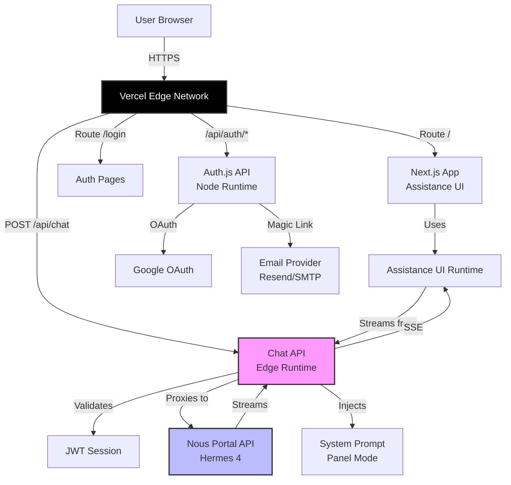
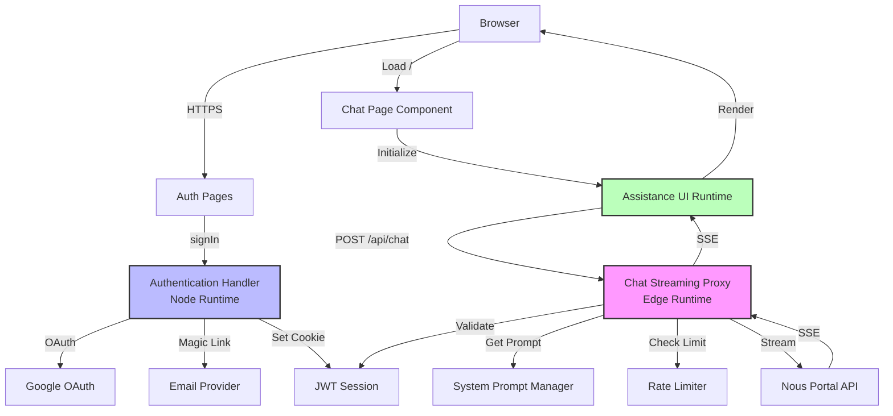
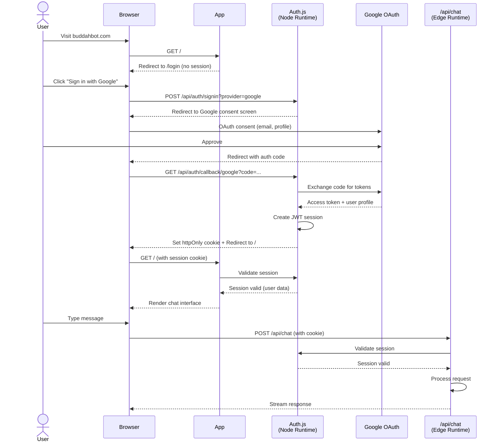
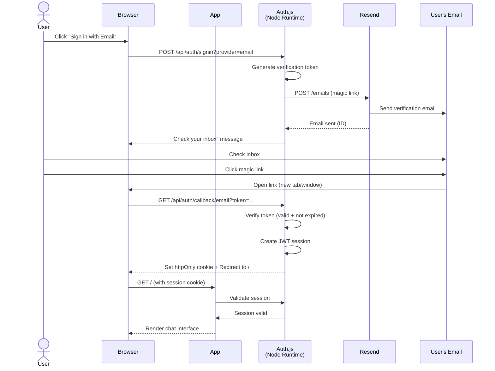
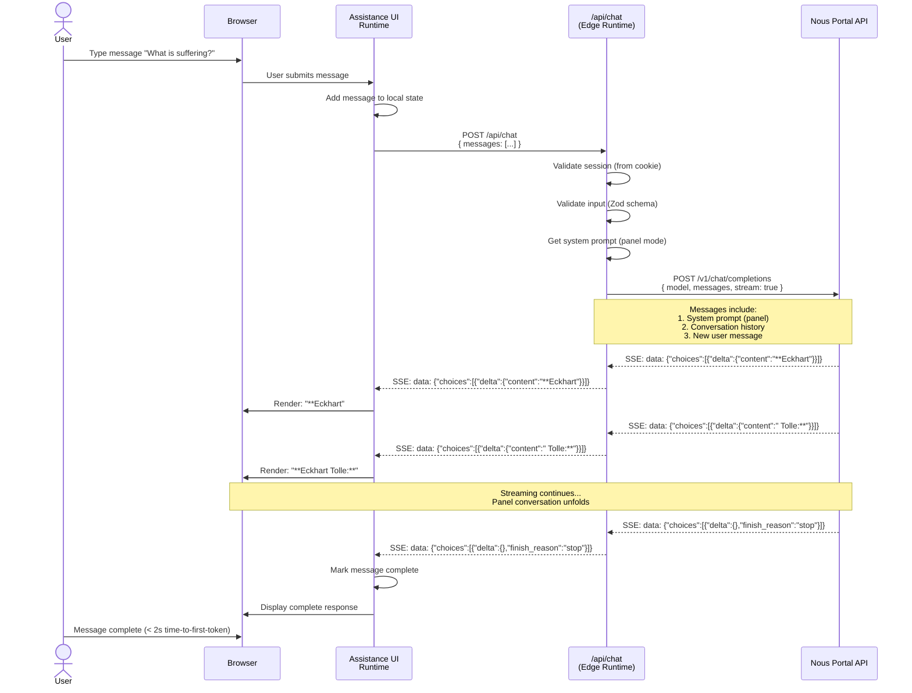
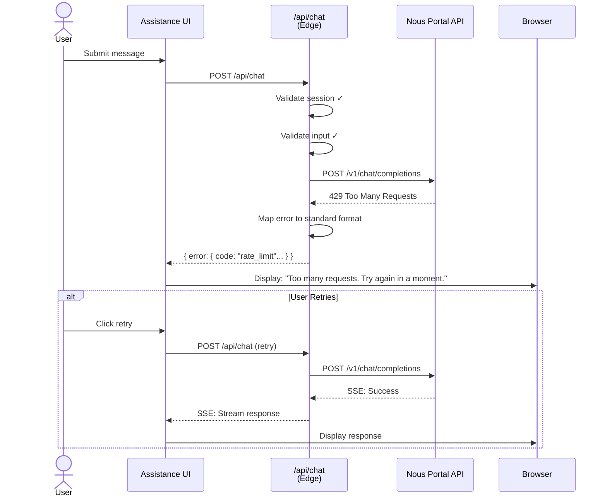
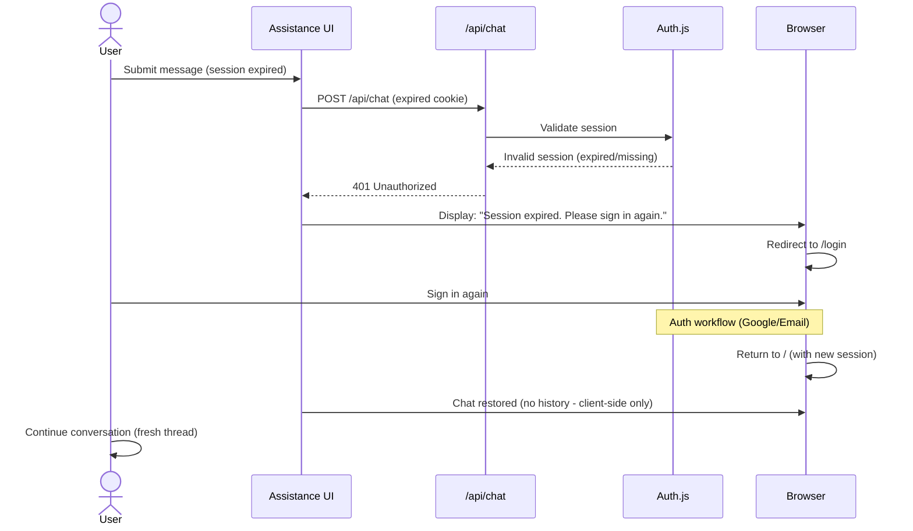
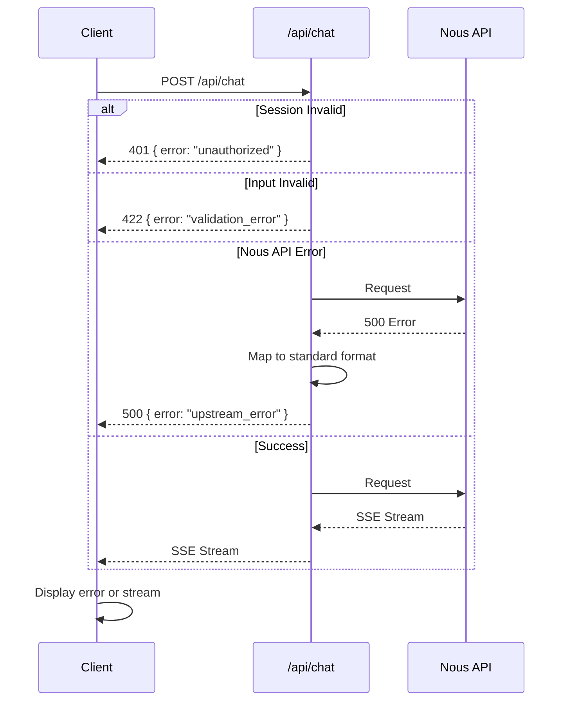

# BuddahBot Fullstack Architecture Document

## Introduction

This document outlines the complete fullstack architecture for **BuddahBot**, including backend systems, frontend implementation, and their integration. It serves as the single source of truth for AI-driven development, ensuring consistency across the entire technology stack.

This unified approach combines what would traditionally be separate backend and frontend architecture documents, streamlining the development process for modern fullstack applications where these concerns are increasingly intertwined.

### Starter Template or Existing Project

**Decision: Assistance UI Framework (`@assistant-ui/react`) on Next.js**

The foundational architectural choice is **Assistance UI** - a complete React framework for building AI chat interfaces. This is not a traditional starter template, but rather a comprehensive UI framework that dictates our frontend architecture.

**What Assistance UI Provides Out-of-Box:**
- Thread and message rendering components
- Composer with voice/text input
- Regenerate/edit functionality
- File sharing capability
- Markdown rendering
- Mobile responsive design
- Runtime provider for API integration

**Technical Foundation:**
- Built on React (works with Next.js App Router)
- Next.js 14+ with App Router for application structure
- Vercel for deployment (optimal for Next.js + Edge runtime)
- TypeScript support

**Why This Choice:**
- PRD explicitly requires chat interface with streaming, voice, regenerate capabilities
- Building these features from scratch would be significant over-engineering
- Assistance UI is purpose-built for exactly this use case
- Allows MVP focus on spiritual guidance logic, not UI plumbing

**What We Build:**
- Next.js application structure
- Auth integration (Auth.js/NextAuth)
- `/api/chat` Edge route to proxy Nous API
- System prompt injection logic
- Integration between Assistance UI runtime and our backend

**Constraints Inherited:**
- Must follow Assistance UI runtime patterns for `/api/chat` endpoint
- Frontend UI customization limited to Assistance UI theming
- Next.js App Router structure (not Pages Router)
- Vercel Edge runtime limits (25s timeout, Node.js for auth)

### Change Log

| Date | Version | Description | Author |
|------|---------|-------------|--------|
| 2025-10-03 | 1.0 | Initial architecture document | Winston (Architect) |

## High Level Architecture

### Technical Summary

BuddahBot employs a **serverless Jamstack architecture** deployed on Vercel, optimizing for simplicity and zero DevOps overhead. The frontend is built with **Assistance UI framework on Next.js 14 (App Router)** with TypeScript, providing a complete chat interface out-of-the-box. The backend consists of two serverless functions: an **Edge runtime** `/api/chat` route for streaming responses with <2s latency, and a **Node runtime** Auth.js handler for authentication. Authentication uses **Auth.js (NextAuth)** with Google OAuth and email magic links, storing sessions as JWT tokens (no database required). The system proxies requests to the **Nous Portal API** (Hermes 4 405B/70B) with spiritual wisdom prompts injected server-side. This architecture achieves the PRD's goals of <2-click access, <2s streaming start, and 99%+ reliability through Vercel's global edge network and proven serverless patterns.

### Platform and Infrastructure Choice

**Platform: Vercel (Recommended)**

**Key Services:**
- **Edge Functions** - `/api/chat` route (global, low-latency streaming)
- **Serverless Functions** - Auth routes (Node.js runtime)
- **Environment Variables** - Secure secret storage
- **Automatic HTTPS** - SSL/TLS out-of-box
- **CDN** - Static asset delivery
- **Analytics** - Built-in monitoring and logs

**Deployment Host and Regions:** Global edge network (automatic)

**Rationale:**
- Zero DevOps: No server management, auto-scaling, automatic SSL
- Optimal for Next.js: First-party integration, App Router support
- Edge runtime: Low-latency streaming across global regions
- Free tier sufficient for MVP and personal use
- Auth.js works seamlessly with Vercel
- Environment variable management built-in

**Alternative Considered:**
- **AWS (Lambda + API Gateway + CloudFront)**: More complex setup, requires expertise in AWS services, over-engineering for MVP
- **Railway/Render**: Simpler than AWS but no Edge runtime, higher latency for streaming

**Decision:** Vercel - best fit for Next.js + Edge streaming + simplicity goals.

### Repository Structure

**Structure:** Single repository (monolith, not monorepo)

**Monorepo Tool:** N/A - Not needed for this project

**Package Organization:** Standard Next.js App Router structure

**Rationale:**
- MVP has no shared packages or multiple apps
- Frontend and backend are tightly coupled (same Next.js app)
- Auth routes and chat routes live in same `/app/api` folder
- No separate frontend/backend repos needed
- YAGNI principle: Don't add monorepo complexity for single app

**Structure Pattern:**
```
buddah-bot/
├── app/                    # Next.js App Router
│   ├── api/               # API routes
│   │   ├── chat/         # Edge runtime streaming
│   │   └── auth/         # Node runtime auth
│   ├── (pages)/          # Frontend routes
│   └── layout.tsx        # Root layout
├── lib/                   # Shared utilities
├── components/            # React components (minimal)
└── public/               # Static assets
```

**Future Consideration:** If Mode 2/3 or multiple frontends are added, consider migrating to monorepo with Turborepo.

### High Level Architecture Diagram



### Architectural Patterns

- **Jamstack Architecture:** Static frontend with serverless API functions - _Rationale:_ Optimal performance, security, and zero DevOps for personal project with minimal traffic

- **Edge-First Streaming:** Use Edge runtime for streaming responses - _Rationale:_ Global low-latency (<2s time-to-first-token), meets PRD performance requirements

- **Backend for Frontend (BFF) Pattern:** `/api/chat` acts as BFF, proxying and enriching requests to Nous API - _Rationale:_ Keeps API keys secure server-side, allows prompt injection logic, shields client from upstream changes

- **Component-Based UI:** Assistance UI framework provides pre-built React components - _Rationale:_ Avoid reinventing chat UI, focus on spiritual guidance logic, faster MVP delivery

- **Stateless Authentication:** JWT-based sessions without database - _Rationale:_ Simplicity for MVP (no DB to manage), Auth.js handles token security, sufficient for small user base

- **API Gateway Pattern:** Vercel acts as implicit API gateway (routing, SSL, caching) - _Rationale:_ No need for separate gateway service, built into platform

- **Proxy Pattern:** Chat route proxies to external Nous API - _Rationale:_ Secure API key management, centralized error handling, request/response transformation

## Tech Stack

This is the DEFINITIVE technology selection for the entire project. All development must use these exact versions.

| Category | Technology | Version | Purpose | Rationale |
|----------|-----------|---------|---------|-----------|
| **Frontend Language** | TypeScript | 5.9.3 | Type-safe frontend development | Latest stable (Oct 2025), catch errors at compile time, better IDE support, required by Assistance UI |
| **Frontend Framework** | Next.js (App Router) | 15.5.4 | React framework with SSR/SSG | Latest stable (Sep 2025), Assistance UI compatible, App Router production-ready, Vercel-optimized |
| **UI Component Library** | Assistance UI | 0.11.10 | AI chat interface framework | Latest version (Oct 2025), purpose-built for chat streaming, provides all chat UI features out-of-box |
| **State Management** | React Context + Assistance UI Runtime | N/A | Minimal state management | No complex client state needed - Assistance UI runtime handles chat state, React Context for auth session |
| **Backend Language** | TypeScript | 5.9.3 | Type-safe backend development | Share types across frontend/backend, serverless functions support TS natively |
| **Backend Framework** | Next.js API Routes | 15.5.4 | Serverless API endpoints | Edge runtime for streaming, Node runtime for auth, unified with frontend |
| **API Style** | REST (OpenAI-compatible) | N/A | Streaming chat completions | Nous API is OpenAI-compatible REST, simple proxy pattern, no GraphQL overhead needed |
| **Database** | None (MVP) | N/A | No persistent storage | JWT sessions require no DB, no conversation history in MVP, YAGNI |
| **Cache** | None (MVP) | N/A | No caching layer | Simple proxy pattern, no need for Redis/caching in MVP |
| **File Storage** | None (MVP) | N/A | No file uploads | Assistance UI supports file sharing but MVP doesn't require it |
| **Authentication** | Auth.js (NextAuth) | 5.0.0-beta | OAuth + Email authentication | Google OAuth + magic links, JWT sessions, Vercel-optimized - **Note: v5 is beta but production-ready** |
| **Frontend Testing** | Vitest + React Testing Library | 3.2.4 + 16.3.0 | Component and unit tests | Vitest latest stable (Jun 2025), RTL with React 19 support (Apr 2025) |
| **Backend Testing** | Vitest | 3.2.4 | API route testing | Unified testing tool for frontend and backend, serverless function testing |
| **E2E Testing** | Playwright | 1.55.1 | End-to-end flows | Latest stable (Sep 2025), auth flow, chat streaming, cross-browser testing |
| **Build Tool** | Next.js (built-in) | 15.5.4 | Transpilation and bundling | Next.js handles all build concerns, no separate build tool needed |
| **Bundler** | Turbopack (dev) / Webpack (prod) | Built-in | Fast dev bundling | Turbopack stable for dev mode, Webpack still default for production builds |
| **IaC Tool** | None (MVP) | N/A | Infrastructure as Code | Vercel handles infrastructure, no manual IaC needed |
| **CI/CD** | Vercel (built-in) | N/A | Continuous deployment | Auto-deploy on git push, preview deployments, zero config |
| **Monitoring** | Vercel Analytics | N/A | Basic metrics and logs | Built-in function logs, error tracking, sufficient for MVP |
| **Logging** | Vercel Logs | N/A | Centralized logging | Serverless function logs, accessible via Vercel dashboard |
| **CSS Framework** | Tailwind CSS | 3.4.x | Utility-first styling | Using v3 legacy (stable), v4 is major rewrite with breaking changes - migrate later if needed |

### Critical Version Notes

**Auth.js v5 Beta:**
- Install: `npm install next-auth@beta`
- Production-ready beta but not 5.0 stable
- Breaking changes from v4: New cookie names, import paths
- **Decision:** Use beta - stable enough for greenfield project

**Tailwind CSS v3 vs v4:**
- **v4.1.13** is latest (major rewrite, CSS-first config)
- **v3.4.x** is legacy but stable
- **Decision:** Start with v3.4.x to avoid migration complexity in MVP

**Turbopack Status:**
- **Dev mode:** Stable (`next dev --turbopack`) - 3.78x faster builds
- **Production builds:** Beta with bundle size concerns
- **Decision:** Use Turbopack for dev, Webpack for production (Next.js default)

**Nous API Integration:**
- **Base URL:** `https://api.nousresearch.com/v1`
- **Models:** `Hermes-4-405B` (128k context, $1.50/1M tokens), `Hermes-4-70B` (128k context, $0.70/1M tokens)
- **Authentication:** Bearer token via `Authorization` header
- **Endpoint:** `/chat/completions` (OpenAI-compatible)
- **Streaming:** SSE format supported
- **Waitlist:** API access requires approval from portal.nousresearch.com
- **Free Credits:** $5 for new accounts

### Installation Commands

```bash
# Core framework
npm install next@15.5.4 react@latest react-dom@latest

# TypeScript
npm install -D typescript@5.9.3 @types/react @types/react-dom @types/node

# UI and styling
npm install @assistant-ui/react@0.11.10
npm install tailwindcss@3.4 postcss autoprefixer

# Authentication
npm install next-auth@beta

# Testing
npm install -D vitest@3.2.4 @testing-library/react@16.3.0 @testing-library/dom
npm install -D playwright@1.55.1

# Development
npm install -D @vitejs/plugin-react
```

## Data Models

Since BuddahBot has **no database** in the MVP, this section focuses on **in-memory data structures and API contracts** rather than persistent models.

### 1. User (Auth Session)

**Purpose:** Represents authenticated user session (managed by Auth.js)

**Key Attributes:**
- `id`: string - Unique user identifier
- `email`: string | null - User email (from OAuth or magic link)
- `name`: string | null - Display name (from OAuth profile)
- `image`: string | null - Profile picture URL (from OAuth)

**TypeScript Interface:**
```typescript
interface User {
  id: string;
  email: string | null;
  name: string | null;
  image: string | null;
}

interface Session {
  user: User;
  expires: string; // ISO 8601 date string
}
```

**Relationships:** None (no persistent storage)

**Notes:**
- Stored as JWT token (client cookie)
- No database persistence required
- Auth.js handles serialization/deserialization

---

### 2. ChatMessage

**Purpose:** Represents a single message in the chat thread (used by Assistance UI and Nous API)

**Key Attributes:**
- `role`: "system" | "user" | "assistant" - Message sender type
- `content`: string - Message text content
- `id`: string (optional) - Client-side message ID for UI tracking

**TypeScript Interface:**
```typescript
interface ChatMessage {
  role: "system" | "user" | "assistant";
  content: string;
  id?: string; // Optional: used by Assistance UI for optimistic updates
}

interface ChatThread {
  messages: ChatMessage[];
}
```

**Relationships:**
- Messages form a conversation thread (array structure)
- System message (panel prompt) prepended server-side
- No persistence - thread exists only in client memory

**Notes:**
- Compatible with OpenAI chat completion format
- Assistance UI manages thread state in browser
- Server is stateless - receives full thread on each request

---

### 3. NousAPIRequest

**Purpose:** Request payload sent to Nous Portal API

**TypeScript Interface:**
```typescript
interface NousAPIRequest {
  model: "Hermes-4-405B" | "Hermes-4-70B";
  messages: ChatMessage[];
  temperature?: number;
  max_tokens?: number;
  stream: boolean;
  top_p?: number;
  frequency_penalty?: number;
  presence_penalty?: number;
}
```

**Relationships:**
- Constructed in `/api/chat` Edge route
- Includes system prompt + user messages

---

### 4. NousAPIResponse (Streaming)

**Purpose:** Server-sent events (SSE) response from Nous API

**TypeScript Interface:**
```typescript
interface StreamChoice {
  index: number;
  delta: {
    role?: "assistant";
    content?: string;
  };
  finish_reason: string | null;
}

interface NousStreamChunk {
  id: string;
  object: "chat.completion.chunk";
  created: number;
  model: string;
  choices: StreamChoice[];
}
```

**Relationships:**
- Streamed as SSE events (data: {...} format)
- Proxied through `/api/chat` to Assistance UI
- Final chunk has `finish_reason: "stop"`

---

### 5. ConversationMode

**Purpose:** Configuration for different conversation modes (Mode 1/2/3)

**TypeScript Interface:**
```typescript
type ModeType = "panel" | "custom" | "wisdom";

interface ConversationMode {
  mode: ModeType;
  systemPrompt: string;
  model: "Hermes-4-405B" | "Hermes-4-70B";
}

interface ModeConfig {
  default: ConversationMode;
  modes: Record<ModeType, ConversationMode>;
}
```

**Notes:**
- MVP uses only "panel" mode
- Mode 2/3 implementation deferred to iteration 1

---

### 6. APIError

**Purpose:** Standardized error format for API responses

**TypeScript Interface:**
```typescript
interface APIError {
  error: {
    code: string;
    message: string;
    statusCode: number;
    details?: Record<string, any>;
  };
}
```

**Notes:**
- Used for both client-facing and internal errors
- Nous API errors are transformed to this format

---

### Data Flow Summary

```mermaid
graph LR
    Client[Client/Assistance UI] -->|ChatMessage[]| Edge[/api/chat Edge]
    Edge -->|Validate| Session[JWT Session]
    Edge -->|Build| Request[NousAPIRequest]
    Request -->|HTTP POST| Nous[Nous API]
    Nous -->|SSE Stream| Response[NousStreamChunk]
    Response -->|Proxy| Edge
    Edge -->|SSE Stream| Client
```

**Key Points:**
- **Type sharing:** All interfaces live in `lib/types.ts` (shared across frontend/backend)
- **Validation:** Use Zod schemas at API boundaries

**⚠️ ARCHITECTURE UPDATE REQUIRED:**
The current design has NO conversation persistence. User correction indicates **conversation history is required**.

**Recommended Changes:**
1. **Add Database:** Vercel Postgres or Supabase for conversation storage
2. **Update Data Models:** Add `Conversation` and persistent `Message` entities with user FK
3. **Modify `/api/chat`:** Save messages before/after streaming
4. **Update Assistance UI:** Load conversation history on mount
5. **Add Conversations List:** UI to view/resume past conversations

**Implementation Impact:** Medium complexity - requires database setup, schema migration, conversation CRUD APIs.

**Alternative (Simpler):** Use `localStorage` for client-side history (no server persistence, per-device only).

**Decision needed:** Server-side DB vs client-side `localStorage` for conversation history.

## API Specification

### REST API: `/api/chat` (OpenAI-Compatible Streaming)

**Base URL:** `https://buddahbot.yourdomain.com/api`

**Endpoint:** `POST /chat`

**Runtime:** Vercel Edge (25s timeout)

**Authentication:** Required (JWT session cookie)

---

#### Request Format

**Headers:**
```
Content-Type: application/json
Cookie: authjs.session-token=<jwt_token>
```

**Body:**
```json
{
  "messages": [
    {
      "role": "user",
      "content": "What is the nature of suffering?"
    }
  ]
}
```

**Schema (Zod):**
```typescript
const ChatRequestSchema = z.object({
  messages: z.array(
    z.object({
      role: z.enum(['user', 'assistant']),
      content: z.string().min(1).max(2000)
    })
  ).max(20)
});
```

---

#### Response Format (SSE Streaming)

**Headers:**
```
Content-Type: text/event-stream; charset=utf-8
Cache-Control: no-cache, no-transform
Connection: keep-alive
```

**Stream Format:**
```
data: {"id":"chatcmpl-abc123","object":"chat.completion.chunk","created":1696789012,"model":"Hermes-4-405B","choices":[{"index":0,"delta":{"role":"assistant","content":"**Eckhart"},"finish_reason":null}]}

data: {"id":"chatcmpl-abc123","object":"chat.completion.chunk","created":1696789012,"model":"Hermes-4-405B","choices":[{"index":0,"delta":{"content":" Tolle:**"},"finish_reason":null}]}

data: {"id":"chatcmpl-abc123","object":"chat.completion.chunk","created":1696789012,"model":"Hermes-4-405B","choices":[{"index":0,"delta":{"content":" Suffering"},"finish_reason":null}]}

data: {"id":"chatcmpl-abc123","object":"chat.completion.chunk","created":1696789012,"model":"Hermes-4-405B","choices":[{"index":0,"delta":{},"finish_reason":"stop"}]}

data: [DONE]
```

---

#### Error Responses

**401 Unauthorized:**
```json
{
  "error": {
    "code": "unauthorized",
    "message": "Authentication required",
    "statusCode": 401
  }
}
```

**422 Validation Error:**
```json
{
  "error": {
    "code": "validation_error",
    "message": "Invalid request format",
    "statusCode": 422,
    "details": [
      {
        "path": ["messages", 0, "content"],
        "message": "String must contain at least 1 character"
      }
    ]
  }
}
```

**429 Rate Limit:**
```json
{
  "error": {
    "code": "rate_limit_exceeded",
    "message": "Too many requests",
    "statusCode": 429
  }
}
```

**500 Internal Error:**
```json
{
  "error": {
    "code": "internal_error",
    "message": "An unexpected error occurred",
    "statusCode": 500
  }
}
```

**504 Timeout:**
```json
{
  "error": {
    "code": "timeout",
    "message": "Request timed out after 25 seconds",
    "statusCode": 504
  }
}
```

---

#### Implementation Notes

- **System Prompt Injection:** Server injects panel prompt before forwarding to Nous API
- **Mode Selection:** Read from `process.env.BUDDAHBOT_MODE` (MVP: always "panel")
- **Streaming:** Pass-through Nous API SSE stream (OpenAI-compatible)
- **Error Mapping:** Transform Nous API errors to standardized format
- **Timeout Handling:** Edge runtime 25s limit with heartbeat keepalive

## Components

### System Component Breakdown

BuddahBot architecture consists of 6 major components split across frontend and backend.

---

### Component 1: Authentication Handler

**Responsibility:** Manage user authentication via Google OAuth and Email magic links

**Key Interfaces:**
- `POST /api/auth/signin` - Initiate auth flow
- `GET /api/auth/callback/google` - OAuth callback
- `GET /api/auth/callback/email` - Magic link verification
- `GET /api/auth/session` - Get current session
- `POST /api/auth/signout` - End session

**Dependencies:**
- Auth.js v5 (NextAuth)
- Google OAuth API
- Email provider (Resend/SMTP)

**Technology Stack:**
- Node.js runtime (not Edge - Auth.js requires Node)
- JWT session strategy
- httpOnly secure cookies

**Implementation Notes:**
- Located at `app/api/auth/[...nextauth]/route.ts`
- Centralized config in `lib/auth.ts`
- Session validation via `auth()` helper
- Cookie names: `authjs.session-token` (dev), `__Secure-authjs.session-token` (prod)

---

### Component 2: Chat Streaming Proxy (Edge)

**Responsibility:** Proxy and stream chat requests from client to Nous API with prompt injection

**Key Interfaces:**
- `POST /api/chat` - Chat completion streaming endpoint

**Dependencies:**
- Nous Portal API
- Auth session (for validation)
- System prompts (panel mode)

**Technology Stack:**
- Vercel Edge runtime
- ReadableStream API (Web Streams)
- Zod validation

**Implementation Pattern:**
```typescript
// app/api/chat/route.ts
export const runtime = 'edge';
export const maxDuration = 25; // Vercel limit

export async function POST(req: Request) {
  // 1. Validate session
  const session = await auth();
  if (!session) return unauthorized();

  // 2. Validate + parse input
  const { messages } = ChatRequestSchema.parse(await req.json());

  // 3. Inject system prompt
  const systemPrompt = getSystemPrompt('panel');

  // 4. Forward to Nous API with streaming
  const response = await fetch('https://api.nousresearch.com/v1/chat/completions', {
    method: 'POST',
    headers: {
      'Authorization': `Bearer ${process.env.NOUS_API_KEY}`,
      'Content-Type': 'application/json',
    },
    body: JSON.stringify({
      model: 'Hermes-4-405B',
      messages: [{ role: 'system', content: systemPrompt }, ...messages],
      stream: true,
    }),
  });

  // 5. Pipe stream to client
  return new Response(response.body, {
    headers: {
      'Content-Type': 'text/event-stream',
      'Cache-Control': 'no-cache',
    },
  });
}
```

**Critical Requirements:**
- Must complete within 25 seconds (Edge timeout)
- Stateless (no conversation history storage)
- Error handling mid-stream
- Rate limiting per user

---

### Component 3: Assistance UI Runtime

**Responsibility:** Client-side chat interface and state management

**Key Interfaces:**
- `useDataStreamRuntime({ api: '/api/chat' })` - Initialize runtime
- `useThread()` - Access chat state
- `useThreadRuntime()` - Perform actions

**Dependencies:**
- Next.js client components
- `/api/chat` endpoint
- Auth session (client-side)

**Technology Stack:**
- @assistant-ui/react 0.11.10
- React 19 (canary in Next.js 15)
- Tailwind CSS for styling

**Component Structure:**
```typescript
// app/page.tsx
"use client";

import { useDataStreamRuntime } from "@assistant-ui/react-data-stream";
import { AssistantRuntimeProvider } from "@assistant-ui/react";
import { Thread } from "@/components/chat/Thread";

export default function ChatPage() {
  const runtime = useDataStreamRuntime({
    api: "/api/chat",
  });

  return (
    <AssistantRuntimeProvider runtime={runtime}>
      <main className="h-screen">
        <Thread />
      </main>
    </AssistantRuntimeProvider>
  );
}
```

**State Management:**
- All chat state managed by Assistance UI runtime
- No external state management needed (no Redux/Zustand)
- React Context only for auth session

---

### Component 4: System Prompt Manager

**Responsibility:** Store and retrieve system prompts for different modes

**Key Interfaces:**
- `getSystemPrompt(mode: ModeType): string` - Get prompt text
- `getModeConfig(): ModeConfig` - Get full mode configuration

**Dependencies:** None (pure data)

**Technology Stack:**
- TypeScript constants
- Environment variables (for mode selection)

**Implementation:**
```typescript
// lib/prompts.ts
export const SYSTEM_PROMPTS = {
  panel: `We are in a panel of experts situation where multiple spiritual advisors give answers to the questions people pose.
**Only 3 of them may speak in answer to a question!**

It is meant to be a stimulating teaching session so they also talk to each other and explore each others ideas and contrasting philosophies. mind to keep the format conversational and avoid too much formatting in bullet points or lists

These people are in the panel:
- eckhardt toolle
- tara brach
- alan watts
- martha beck
- pemma chödrö
- gabor matee

# Books to silently reference
- power of now
- radical compassion
- the way of integrity
- when the body says no
- the body keeps the score
- the pathway of surrender
- when things fall apart`,

  // Mode 2/3 deferred to iteration 1
  custom: '',
  wisdom: '',
} as const;

export function getSystemPrompt(mode: ModeType = 'panel'): string {
  return SYSTEM_PROMPTS[mode];
}
```

**Critical Notes:**
- **DO NOT MODIFY** panel prompt text (PRD requirement)
- Use exact text from PRD Section 3
- Mode selection via `process.env.BUDDAHBOT_MODE` (default: "panel")

---

### Component 5: Auth Pages (Login/Error)

**Responsibility:** User-facing authentication UI

**Key Interfaces:**
- `/login` - Sign-in page
- `/auth/error` - Auth error page

**Dependencies:**
- Auth.js `signIn()` helper
- Next.js App Router

**Technology Stack:**
- Server components (page shells)
- Client components (sign-in buttons)
- Tailwind CSS

**Implementation:**
```typescript
// app/login/page.tsx
import { SignInButtons } from "@/components/auth/SignInButtons";

export default function LoginPage() {
  return (
    <main className="flex min-h-screen items-center justify-center">
      <div className="max-w-md w-full space-y-8">
        <h1 className="text-3xl font-bold text-center">BuddahBot</h1>
        <p className="text-center text-gray-600">
          Sign in to access spiritual wisdom guidance
        </p>
        <SignInButtons />
      </div>
    </main>
  );
}

// components/auth/SignInButtons.tsx
"use client";

import { signIn } from "next-auth/react";

export function SignInButtons() {
  return (
    <div className="space-y-4">
      <button
        onClick={() => signIn("google", { callbackUrl: "/" })}
        className="w-full btn-primary"
      >
        Sign in with Google
      </button>
      <button
        onClick={() => signIn("email", { callbackUrl: "/" })}
        className="w-full btn-secondary"
      >
        Sign in with Email
      </button>
    </div>
  );
}
```

---

### Component 6: Rate Limiter (Optional for MVP)

**Responsibility:** Prevent abuse via rate limiting

**Key Interfaces:**
- `checkRateLimit(userId: string): Promise<{ success: boolean }>` - Validate request

**Dependencies:**
- Upstash Redis (or Vercel KV)

**Technology Stack:**
- @upstash/ratelimit
- Edge runtime compatible

**Implementation:**
```typescript
// lib/rate-limit.ts
import { Ratelimit } from "@upstash/ratelimit";
import { Redis } from "@upstash/redis";

export const ratelimit = new Ratelimit({
  redis: Redis.fromEnv(),
  limiter: Ratelimit.slidingWindow(10, "60 s"), // 10 requests per minute
  analytics: true,
});

// Usage in /api/chat
const { success } = await ratelimit.limit(session.user.id);
if (!success) {
  return new Response('Rate limit exceeded', { status: 429 });
}
```

**MVP Decision:** Optional - add if abuse observed

---

### Component Interaction Diagram



## External APIs

### 1. Nous Research Portal API

**Purpose:** AI model inference for spiritual wisdom responses

**Documentation:** https://portal.nousresearch.com/api-docs

**Base URL:** `https://api.nousresearch.com/v1`

**Authentication:** Bearer token

```bash
Authorization: Bearer ${NOUS_API_KEY}
```

**API Key Management:**
1. Sign up at https://portal.nousresearch.com
2. Join API waitlist (first-come, first-serve)
3. Generate API key at https://portal.nousresearch.com/api-keys
4. Add to Vercel environment variables

**Rate Limits:** Not publicly documented - monitor 429 responses

**Key Endpoints Used:**

#### POST `/chat/completions`

**Request:**
```json
{
  "model": "Hermes-4-405B",
  "messages": [
    { "role": "system", "content": "<panel prompt>" },
    { "role": "user", "content": "User question" }
  ],
  "stream": true,
  "temperature": 0.7,
  "max_tokens": 2048
}
```

**Response:** SSE stream (OpenAI-compatible format)

**Pricing:**
- Hermes-4-405B: $1.50 per 1M tokens
- Hermes-4-70B: $0.70 per 1M tokens
- Free credits: $5 for new accounts

**Context Window:** 128,000 tokens (both models)

**Integration Notes:**
- Fully OpenAI-compatible API
- No custom SDK needed - use standard fetch
- Supports streaming via SSE
- System prompts fully supported
- Model parameter: use exact casing (`Hermes-4-405B` not `hermes-4-405b`)

---

### 2. Google OAuth API

**Purpose:** User authentication via Google accounts

**Documentation:** https://developers.google.com/identity/protocols/oauth2

**OAuth 2.0 Endpoints:**
- Authorization: `https://accounts.google.com/o/oauth2/v2/auth`
- Token: `https://oauth2.googleapis.com/token`
- User Info: `https://www.googleapis.com/oauth2/v1/userinfo`

**Authentication:** OAuth 2.0 client credentials

**Setup:**
1. Create project at https://console.cloud.google.com
2. Enable Google+ API
3. Create OAuth 2.0 credentials (Web application)
4. Add authorized redirect URI: `https://yourdomain.com/api/auth/callback/google`
5. Save Client ID and Secret to environment variables

**Required Scopes:**
- `openid`
- `email`
- `profile`

**Environment Variables:**
```bash
AUTH_GOOGLE_ID=<client_id>.apps.googleusercontent.com
AUTH_GOOGLE_SECRET=<client_secret>
```

**Integration Notes:**
- Handled automatically by Auth.js Google provider
- No rate limits for OAuth flow
- Profile images served from Google CDN
- Consider consent screen customization for brand consistency

---

### 3. Email Provider (Resend)

**Purpose:** Send magic link authentication emails

**Documentation:** https://resend.com/docs

**Base URL:** `https://api.resend.com`

**Authentication:** API key in header

```bash
Authorization: Bearer ${AUTH_RESEND_KEY}
```

**API Key Management:**
1. Sign up at https://resend.com
2. Verify domain for sending
3. Generate API key
4. Add to Vercel environment variables

**Rate Limits:**
- Free tier: 100 emails/day
- Pro: 50,000 emails/month

**Key Endpoints Used:**

#### POST `/emails`

**Request:**
```json
{
  "from": "noreply@yourdomain.com",
  "to": "user@example.com",
  "subject": "Sign in to BuddahBot",
  "html": "<p>Click <a href='https://yourdomain.com/api/auth/callback/email?token=xxx'>here</a> to sign in.</p>"
}
```

**Response:**
```json
{
  "id": "email-id-12345",
  "from": "noreply@yourdomain.com",
  "to": "user@example.com",
  "created_at": "2025-10-03T12:00:00Z"
}
```

**Integration Notes:**
- Integrated via Auth.js Resend provider
- Magic links expire in 24 hours (Auth.js default)
- Consider custom email templates for branding
- Requires verified domain for production sending

**Alternative:** Use SMTP provider if Resend not available

---

### External API Summary Table

| API | Purpose | Auth Method | Rate Limits | Cost |
|-----|---------|-------------|-------------|------|
| Nous Portal | AI inference | Bearer token | TBD | $0.70-$1.50/1M tokens |
| Google OAuth | User authentication | OAuth 2.0 | None (OAuth flow) | Free |
| Resend | Magic link emails | API key | 100/day (free) | Free (low volume) |

**Environment Variables Checklist:**
```bash
# Nous API
NOUS_API_KEY=sk_nous_...
NOUS_API_BASE_URL=https://api.nousresearch.com/v1
HERMES_MODEL=Hermes-4-405B

# Google OAuth
AUTH_GOOGLE_ID=...apps.googleusercontent.com
AUTH_GOOGLE_SECRET=GOCSPX-...

# Resend
AUTH_RESEND_KEY=re_...

# Auth.js
AUTH_SECRET=<openssl rand -base64 32>
AUTH_URL=https://buddahbot.yourdomain.com
```

## Core Workflows

### Workflow 1: Google OAuth Authentication



**Key Points:**
- **Stateless:** No server-side session storage (JWT only)
- **Cookie Security:** httpOnly, secure (prod), sameSite=lax
- **Redirect Flow:** `/` → `/login` → Google → callback → `/`
- **Session Lifetime:** 30 days (configurable)

---

### Workflow 2: Email Magic Link Authentication



**Key Points:**
- **Token Expiry:** 24 hours (Auth.js default)
- **One-Time Use:** Token invalidated after use
- **No Password:** Zero password management complexity
- **Email Verification:** User must have access to email inbox

---

### Workflow 3: Chat Streaming (Happy Path)



**Performance Targets:**
- **Time-to-first-token:** < 2 seconds
- **Streaming start:** < 2 seconds (PRD requirement)
- **Total completion:** < 25 seconds (Edge timeout)
- **Request completion rate:** > 99% (PRD requirement)

---

### Workflow 4: Error Handling (Network/API Failure)



**Error Scenarios:**
- **401 Unauthorized:** Session expired → redirect to login
- **422 Validation Error:** Invalid input → display field errors
- **429 Rate Limit:** Too many requests → retry with backoff
- **500 Internal Error:** Nous API down → display generic error + retry option
- **504 Timeout:** Request > 25s → notify user, allow retry

---

### Workflow 5: Session Expiry Mid-Chat



**Session Behavior:**
- **Expiry:** 30 days of inactivity
- **No Persistence:** Previous conversation lost (no DB)
- **Client State:** Assistance UI maintains thread in memory (cleared on refresh)
- **Graceful UX:** Clear message + redirect to login

## Frontend Architecture

### Component Organization

Assistance UI provides pre-built chat components. We customize styling via Tailwind and add minimal custom components.

**Directory Structure:**
```
app/
├── (auth)/
│   ├── login/
│   │   └── page.tsx              # Login page
│   └── auth/
│       └── error/
│           └── page.tsx          # Auth error page
├── (chat)/
│   └── page.tsx                  # Main chat page (Assistance UI)
├── layout.tsx                    # Root layout (providers)
└── api/
    ├── chat/
    │   └── route.ts              # Edge streaming endpoint
    └── auth/[...nextauth]/
        └── route.ts              # Auth handler

components/
├── chat/
│   ├── Thread.tsx                # Thread wrapper (Assistance UI)
│   ├── Composer.tsx              # Message input (Assistance UI)
│   ├── UserMessage.tsx           # User message bubble
│   └── AssistantMessage.tsx      # AI message bubble
└── auth/
    └── SignInButtons.tsx         # Login buttons

lib/
├── auth.ts                       # Auth.js config
├── prompts.ts                    # System prompts
└── types.ts                      # Shared TypeScript types
```

---

### Component Templates

#### Main Chat Page
```typescript
// app/(chat)/page.tsx
"use client";

import { useDataStreamRuntime } from "@assistant-ui/react-data-stream";
import { AssistantRuntimeProvider } from "@assistant-ui/react";
import { Thread } from "@/components/chat/Thread";

export default function ChatPage() {
  const runtime = useDataStreamRuntime({
    api: "/api/chat",
  });

  return (
    <AssistantRuntimeProvider runtime={runtime}>
      <main className="h-screen bg-gray-50">
        <Thread />
      </main>
    </AssistantRuntimeProvider>
  );
}
```

#### Thread Component
```typescript
// components/chat/Thread.tsx
"use client";

import { ThreadPrimitive } from "@assistant-ui/react";
import { Composer } from "./Composer";
import { UserMessage } from "./UserMessage";
import { AssistantMessage } from "./AssistantMessage";

export function Thread() {
  return (
    <ThreadPrimitive.Root className="h-full flex flex-col">
      <ThreadPrimitive.Viewport className="flex-1 overflow-y-auto p-4">
        <ThreadPrimitive.Empty>
          <div className="flex items-center justify-center h-full">
            <p className="text-gray-500 text-center">
              Ask a question to begin your spiritual wisdom conversation
            </p>
          </div>
        </ThreadPrimitive.Empty>

        <ThreadPrimitive.Messages
          components={{
            UserMessage,
            AssistantMessage,
          }}
        />
      </ThreadPrimitive.Viewport>

      <Composer />
    </ThreadPrimitive.Root>
  );
}
```

#### Composer Component
```typescript
// components/chat/Composer.tsx
"use client";

import { ComposerPrimitive } from "@assistant-ui/react";

export function Composer() {
  return (
    <ComposerPrimitive.Root className="border-t border-gray-200 bg-white p-4">
      <div className="max-w-3xl mx-auto">
        <ComposerPrimitive.Input
          className="w-full resize-none border border-gray-300 rounded-lg p-3 focus:outline-none focus:ring-2 focus:ring-blue-500"
          placeholder="Ask your question..."
          rows={3}
        />
        <div className="mt-2 flex justify-end">
          <ComposerPrimitive.Send className="px-4 py-2 bg-blue-600 text-white rounded-lg hover:bg-blue-700 disabled:opacity-50">
            Send
          </ComposerPrimitive.Send>
        </div>
      </div>
    </ComposerPrimitive.Root>
  );
}
```

#### Message Components
```typescript
// components/chat/UserMessage.tsx
import { MessagePrimitive } from "@assistant-ui/react";

export function UserMessage() {
  return (
    <MessagePrimitive.Root className="flex justify-end mb-4">
      <div className="bg-blue-600 text-white rounded-lg p-4 max-w-[80%]">
        <MessagePrimitive.Content />
      </div>
    </MessagePrimitive.Root>
  );
}

// components/chat/AssistantMessage.tsx
export function AssistantMessage() {
  return (
    <MessagePrimitive.Root className="flex justify-start mb-4">
      <div className="bg-white border border-gray-200 rounded-lg p-4 max-w-[80%] prose prose-sm">
        <MessagePrimitive.Content />
      </div>
    </MessagePrimitive.Root>
  );
}
```

---

### State Management

**No external state management library needed.**

Assistance UI Runtime handles all chat state internally:
- Message history
- Streaming status
- Composer text
- Thread branching

**Access state (read-only):**
```typescript
import { useThread } from "@assistant-ui/react";

function ChatStatus() {
  const { messages, isRunning } = useThread();

  return (
    <div>
      <p>{messages.length} messages</p>
      <p>{isRunning ? "Streaming..." : "Ready"}</p>
    </div>
  );
}
```

**Perform actions:**
```typescript
import { useThreadRuntime } from "@assistant-ui/react";

function Controls() {
  const thread = useThreadRuntime();

  return (
    <button onClick={() => thread.cancelRun()}>
      Stop
    </button>
  );
}
```

**Auth session (React Context):**
```typescript
// app/layout.tsx
import { SessionProvider } from "next-auth/react";

export default function RootLayout({ children }) {
  return (
    <SessionProvider>
      {children}
    </SessionProvider>
  );
}

// components/UserProfile.tsx
"use client";

import { useSession } from "next-auth/react";

export function UserProfile() {
  const { data: session } = useSession();

  return <p>{session?.user?.name}</p>;
}
```

---

### Routing Architecture

Next.js 15 App Router with route groups for organization.

**Route Structure:**
```
app/
├── (auth)/            # Auth route group (shared layout)
│   ├── login/
│   │   └── page.tsx   # /login
│   └── auth/
│       └── error/
│           └── page.tsx # /auth/error
├── (chat)/            # Chat route group (protected)
│   └── page.tsx       # / (main chat)
└── layout.tsx         # Root layout (providers)
```

**Route Protection (Middleware):**
```typescript
// middleware.ts
import { auth } from "@/lib/auth";
import { NextResponse } from "next/server";

export default auth((req) => {
  const isLoggedIn = !!req.auth;
  const { pathname } = req.nextUrl;

  // Public routes
  if (pathname.startsWith("/login") || pathname.startsWith("/api/auth")) {
    return NextResponse.next();
  }

  // Protected routes
  if (!isLoggedIn) {
    return NextResponse.redirect(new URL("/login", req.url));
  }

  return NextResponse.next();
});

export const config = {
  matcher: [
    "/((?!_next/static|_next/image|favicon.ico).*)",
  ],
};
```

**Navigation (programmatic):**
```typescript
"use client";

import { useRouter } from "next/navigation";

function Navigation() {
  const router = useRouter();

  return (
    <button onClick={() => router.push("/")}>
      Chat
    </button>
  );
}
```

---

### Frontend Services Layer

**API Client (fetch wrapper):**
```typescript
// lib/api-client.ts
export class APIError extends Error {
  constructor(
    message: string,
    public statusCode: number,
    public code: string,
    public details?: any
  ) {
    super(message);
  }
}

export async function apiRequest<T>(
  endpoint: string,
  options?: RequestInit
): Promise<T> {
  const response = await fetch(endpoint, {
    ...options,
    headers: {
      "Content-Type": "application/json",
      ...options?.headers,
    },
  });

  if (!response.ok) {
    const error = await response.json();
    throw new APIError(
      error.error.message,
      response.status,
      error.error.code,
      error.error.details
    );
  }

  return response.json();
}
```

**Usage:**
```typescript
// Not needed for chat (Assistance UI handles)
// But useful for future features

import { apiRequest } from "@/lib/api-client";

async function saveSettings(settings: Settings) {
  return apiRequest("/api/settings", {
    method: "POST",
    body: JSON.stringify(settings),
  });
}
```

## Backend Architecture

### Service Architecture: Serverless (Vercel)

BuddahBot uses Vercel's serverless architecture with **dual runtime strategy**:
- **Edge Runtime:** Chat streaming (`/api/chat`)
- **Node Runtime:** Authentication (`/api/auth/*`)

---

### Edge Runtime: Chat Streaming

**File:** `app/api/chat/route.ts`

```typescript
import { auth } from "@/lib/auth";
import { getSystemPrompt } from "@/lib/prompts";
import { z } from "zod";

export const runtime = "edge";
export const maxDuration = 25; // Vercel Edge limit

const ChatRequestSchema = z.object({
  messages: z.array(
    z.object({
      role: z.enum(["user", "assistant"]),
      content: z.string().min(1).max(2000),
    })
  ).max(20),
});

export async function POST(req: Request) {
  try {
    // 1. Validate session
    const session = await auth();
    if (!session?.user) {
      return new Response(
        JSON.stringify({ error: { code: "unauthorized", message: "Authentication required", statusCode: 401 } }),
        { status: 401, headers: { "Content-Type": "application/json" } }
      );
    }

    // 2. Validate request body
    const body = await req.json();
    const { messages } = ChatRequestSchema.parse(body);

    // 3. Get system prompt
    const mode = (process.env.BUDDAHBOT_MODE as any) || "panel";
    const systemPrompt = getSystemPrompt(mode);

    // 4. Build Nous API request
    const nousRequest = {
      model: process.env.HERMES_MODEL || "Hermes-4-405B",
      messages: [
        { role: "system", content: systemPrompt },
        ...messages,
      ],
      temperature: 0.7,
      max_tokens: 2048,
      stream: true,
    };

    // 5. Call Nous API
    const response = await fetch(`${process.env.NOUS_API_BASE_URL}/chat/completions`, {
      method: "POST",
      headers: {
        "Authorization": `Bearer ${process.env.NOUS_API_KEY}`,
        "Content-Type": "application/json",
      },
      body: JSON.stringify(nousRequest),
    });

    if (!response.ok) {
      const error = await response.json().catch(() => ({ message: "Unknown error" }));
      return new Response(
        JSON.stringify({
          error: {
            code: "upstream_error",
            message: error.message || "Nous API error",
            statusCode: response.status
          }
        }),
        { status: response.status, headers: { "Content-Type": "application/json" } }
      );
    }

    // 6. Stream response to client
    return new Response(response.body, {
      headers: {
        "Content-Type": "text/event-stream; charset=utf-8",
        "Cache-Control": "no-cache, no-transform",
        "Connection": "keep-alive",
      },
    });

  } catch (error) {
    if (error instanceof z.ZodError) {
      return new Response(
        JSON.stringify({
          error: {
            code: "validation_error",
            message: "Invalid request",
            statusCode: 422,
            details: error.errors
          }
        }),
        { status: 422, headers: { "Content-Type": "application/json" } }
      );
    }

    console.error("Chat route error:", error);
    return new Response(
      JSON.stringify({
        error: {
          code: "internal_error",
          message: "An unexpected error occurred",
          statusCode: 500
        }
      }),
      { status: 500, headers: { "Content-Type": "application/json" } }
    );
  }
}
```

**Key Patterns:**
- **Session validation:** First action - fail fast if unauthorized
- **Input validation:** Zod schema prevents invalid data reaching Nous API
- **Error mapping:** Transform upstream errors to standard format
- **Direct streaming:** Pipe Nous response body to client (no buffering)
- **Timeout awareness:** 25s Edge limit, no explicit timeout handling needed (platform enforces)

---

### Node Runtime: Authentication

**File:** `app/api/auth/[...nextauth]/route.ts`

```typescript
import { handlers } from "@/lib/auth";

export const { GET, POST } = handlers;
```

**File:** `lib/auth.ts`

```typescript
import NextAuth from "next-auth";
import Google from "next-auth/providers/google";
import Resend from "next-auth/providers/resend";

export const { handlers, auth, signIn, signOut } = NextAuth({
  providers: [
    Google({
      clientId: process.env.AUTH_GOOGLE_ID!,
      clientSecret: process.env.AUTH_GOOGLE_SECRET!,
    }),
    Resend({
      from: process.env.EMAIL_FROM || "noreply@yourdomain.com",
    }),
  ],
  session: {
    strategy: "jwt",
    maxAge: 30 * 24 * 60 * 60, // 30 days
  },
  pages: {
    signIn: "/login",
    error: "/auth/error",
  },
  callbacks: {
    async jwt({ token, user }) {
      if (user) {
        token.id = user.id;
      }
      return token;
    },
    async session({ session, token }) {
      if (token && session.user) {
        session.user.id = token.sub!;
      }
      return session;
    },
  },
});
```

**Key Patterns:**
- **Centralized config:** Single source of truth in `lib/auth.ts`
- **JWT sessions:** No database required
- **Dual providers:** Google OAuth + Email magic links
- **httpOnly cookies:** Secure session storage

---

### Authentication Middleware

**File:** `middleware.ts`

```typescript
import { auth } from "@/lib/auth";
import { NextResponse } from "next/server";

export default auth((req) => {
  const isLoggedIn = !!req.auth;
  const { pathname } = req.nextUrl;

  // Allow public routes
  if (
    pathname.startsWith("/login") ||
    pathname.startsWith("/api/auth") ||
    pathname.startsWith("/_next") ||
    pathname === "/favicon.ico"
  ) {
    return NextResponse.next();
  }

  // Redirect to login if not authenticated
  if (!isLoggedIn) {
    return NextResponse.redirect(new URL("/login", req.url));
  }

  return NextResponse.next();
});

export const config = {
  matcher: ["/((?!_next/static|_next/image).*)"],
};
```

**Execution:** Runs on Edge runtime (Auth.js v5 supports this)

## Unified Project Structure

```
buddah-bot/
├── .github/
│   └── workflows/
│       └── ci.yaml                  # Vercel auto-deploys (optional CI checks)
├── app/
│   ├── (auth)/                      # Auth route group
│   │   ├── login/
│   │   │   └── page.tsx             # Login page
│   │   └── auth/
│   │       └── error/
│   │           └── page.tsx         # Auth error page
│   ├── (chat)/                      # Chat route group (protected)
│   │   └── page.tsx                 # Main chat interface
│   ├── api/
│   │   ├── chat/
│   │   │   └── route.ts             # Edge: Chat streaming endpoint
│   │   └── auth/
│   │       └── [...nextauth]/
│   │           └── route.ts         # Node: Auth handler
│   ├── layout.tsx                   # Root layout (SessionProvider)
│   └── globals.css                  # Global styles (Tailwind)
├── components/
│   ├── chat/
│   │   ├── Thread.tsx               # Thread wrapper (Assistance UI)
│   │   ├── Composer.tsx             # Message input
│   │   ├── UserMessage.tsx          # User message bubble
│   │   └── AssistantMessage.tsx     # AI response bubble
│   └── auth/
│       └── SignInButtons.tsx        # Google/Email sign-in
├── lib/
│   ├── auth.ts                      # Auth.js config (centralized)
│   ├── prompts.ts                   # System prompts (panel mode)
│   ├── types.ts                     # Shared TypeScript types
│   └── api-client.ts                # API request wrapper (optional)
├── public/
│   ├── favicon.ico
│   └── logo.png                     # BuddahBot branding
├── docs/
│   ├── prd.md                       # Product requirements
│   └── architecture.md              # This document
├── .env.local.example               # Environment template
├── .env.local                       # Local dev vars (gitignored)
├── .eslintrc.json                   # ESLint config
├── .gitignore
├── middleware.ts                    # Route protection
├── next.config.js                   # Next.js config
├── package.json
├── postcss.config.js                # Tailwind PostCSS
├── tailwind.config.ts               # Tailwind config
├── tsconfig.json                    # TypeScript config
├── vercel.json                      # Vercel config (optional)
└── README.md
```

**Key Organizational Principles:**
- **Route Groups:** `(auth)` and `(chat)` organize related pages without affecting URLs
- **Colocation:** Components near where they're used (`components/chat/`, `components/auth/`)
- **Centralized Config:** Auth, prompts, types in `lib/`
- **API Routes:** Separated by runtime (`chat/` = Edge, `auth/` = Node)
- **No Monorepo:** Single Next.js app (YAGNI - no need for packages/apps split)

## Development Workflow

### Prerequisites

```bash
# Node.js 18.17+ or 20+ (Next.js 15 requirement)
node --version  # Should be >= 18.17

# npm 9+ (comes with Node 18+)
npm --version

# Git
git --version
```

---

### Initial Setup

```bash
# 1. Clone repository (if not already done)
git clone <repository-url>
cd buddah-bot

# 2. Install dependencies
npm install

# 3. Copy environment template
cp .env.local.example .env.local

# 4. Configure environment variables
# Edit .env.local with your keys:
# - NOUS_API_KEY (from portal.nousresearch.com)
# - AUTH_GOOGLE_ID & AUTH_GOOGLE_SECRET (from Google Console)
# - AUTH_RESEND_KEY (from resend.com)
# - AUTH_SECRET (generate with: openssl rand -base64 32)

# 5. Initialize Tailwind CSS (if not done)
npx tailwindcss init -p

# 6. (Optional) Setup Git hooks
# Create .husky/ directory for pre-commit hooks
```

---

### Development Commands

```bash
# Start dev server (with Turbopack)
npm run dev
# Opens at http://localhost:3000

# Start dev server (without Turbopack - fallback)
npm run dev:webpack

# Build for production
npm run build

# Start production server (locally)
npm run start

# Lint code
npm run lint

# Lint and fix
npm run lint:fix

# Type check
npm run type-check

# Run tests (unit + integration)
npm test

# Run tests in watch mode
npm test:watch

# Run E2E tests
npm run test:e2e

# Run E2E tests in UI mode
npm run test:e2e:ui
```

---

### Environment Configuration

#### Required Environment Variables

**Development (`.env.local`):**
```bash
# Nous API
NOUS_API_KEY=sk_nous_your_key_here
NOUS_API_BASE_URL=https://api.nousresearch.com/v1
HERMES_MODEL=Hermes-4-405B

# Mode Selection
BUDDAHBOT_MODE=panel

# Auth - Google OAuth
AUTH_GOOGLE_ID=your-client-id.apps.googleusercontent.com
AUTH_GOOGLE_SECRET=GOCSPX-your-secret

# Auth - Email Magic Link
EMAIL_FROM=noreply@yourdomain.com
AUTH_RESEND_KEY=re_your_resend_key

# Auth.js
AUTH_SECRET=generate_with_openssl_rand_base64_32
AUTH_URL=http://localhost:3000

# App
NODE_ENV=development
```

**Production (Vercel Environment Variables):**
```bash
# Same as above, but:
AUTH_URL=https://buddahbot.yourdomain.com
NODE_ENV=production

# Vercel automatically provides:
# VERCEL=1
# VERCEL_ENV=production
# VERCEL_URL=buddahbot.vercel.app
```

---

### Development Workflow Best Practices

1. **Branch Strategy:**
   ```bash
   git checkout -b feature/your-feature-name
   # Make changes
   git add .
   git commit -m "feat: add feature description"
   git push origin feature/your-feature-name
   # Create PR on GitHub
   ```

2. **Code Quality Checks:**
   ```bash
   # Before committing
   npm run lint
   npm run type-check
   npm test
   ```

3. **Local Testing:**
   ```bash
   # Test build locally before deploying
   npm run build
   npm run start
   # Visit http://localhost:3000
   ```

4. **Environment Sync:**
   - Keep `.env.local.example` updated with new variables
   - Never commit `.env.local` to Git
   - Update Vercel env vars when adding new variables

5. **Hot Reload:**
   - Next.js dev server auto-reloads on file changes
   - Turbopack provides faster HMR (3.78x faster)
   - If HMR breaks, restart dev server

## Deployment Architecture

### Deployment Strategy

**Platform:** Vercel (zero-config deployment)

**Deployment Triggers:**
- **Production:** Push to `main` branch → auto-deploy to production
- **Preview:** Push to any branch → auto-deploy to preview URL
- **Local:** Manual deploy via `vercel --prod`

---

### Frontend Deployment

**Platform:** Vercel Edge Network

**Build Command:**
```bash
npm run build
# Equivalent to: next build
```

**Output Directory:**
```
.next/
```

**CDN/Edge:**
- Static assets served from Vercel CDN
- Edge runtime functions deployed globally
- Automatic SSL/TLS certificates

**Environment:**
- Static pages: Pre-rendered at build time
- Dynamic pages: Server-rendered on request
- Edge API routes: Executed at nearest edge location

---

### Backend Deployment

**Platform:** Vercel Serverless Functions

**Build Command:** Included in `next build`

**Deployment Method:**
- Edge runtime: `/api/chat` (streaming)
- Node runtime: `/api/auth/*` (authentication)
- Automatic function detection from `export const runtime`

**Configuration:**
```typescript
// app/api/chat/route.ts
export const runtime = "edge";
export const maxDuration = 25; // seconds

// app/api/auth/[...nextauth]/route.ts
// Defaults to Node runtime (no export needed)
```

---

### CI/CD Pipeline

**Default: Vercel GitHub Integration**

1. **Setup:**
   - Connect GitHub repo to Vercel
   - Vercel auto-detects Next.js project
   - Configure environment variables in Vercel dashboard

2. **Automatic Deployments:**
   ```
   git push origin main
   ↓
   Vercel detects push
   ↓
   Runs: npm install && npm run build
   ↓
   Deploys to production (if main) or preview (if branch)
   ↓
   Updates deployment URL
   ```

3. **Manual Deployment:**
   ```bash
   # Install Vercel CLI
   npm i -g vercel

   # Deploy to production
   vercel --prod

   # Deploy preview
   vercel
   ```

**Optional GitHub Actions (`.github/workflows/ci.yaml`):**
```yaml
name: CI

on:
  push:
    branches: [main]
  pull_request:
    branches: [main]

jobs:
  lint-and-test:
    runs-on: ubuntu-latest
    steps:
      - uses: actions/checkout@v4
      - uses: actions/setup-node@v4
        with:
          node-version: 20
          cache: 'npm'

      - run: npm ci
      - run: npm run lint
      - run: npm run type-check
      - run: npm test

      # Vercel handles deployment automatically
```

---

### Environments

| Environment | Frontend URL | Backend URL | Purpose | Branch |
|-------------|-------------|-------------|---------|--------|
| **Development** | http://localhost:3000 | http://localhost:3000/api | Local development | N/A |
| **Preview** | https://buddahbot-git-[branch]-[team].vercel.app | Same | Feature testing, PRs | Any non-main |
| **Production** | https://buddahbot.yourdomain.com | Same | Live users | main |

**Custom Domain Setup:**
1. Go to Vercel dashboard → Settings → Domains
2. Add custom domain: `buddahbot.yourdomain.com`
3. Follow DNS configuration instructions (add A/CNAME records)
4. Vercel auto-provisions SSL certificate

---

### Deployment Checklist

**Before First Deploy:**
- [ ] Environment variables configured in Vercel
- [ ] Custom domain added (if applicable)
- [ ] Google OAuth callback URLs updated for production domain
- [ ] Resend domain verified for production sending
- [ ] `AUTH_URL` set to production domain

**Before Each Deploy:**
- [ ] Code passes `npm run lint`
- [ ] Code passes `npm run type-check`
- [ ] Tests pass `npm test`
- [ ] Build succeeds locally `npm run build`
- [ ] Environment variables updated (if new ones added)

**After Deploy:**
- [ ] Test login flow (Google OAuth)
- [ ] Test login flow (Email magic link)
- [ ] Test chat streaming
- [ ] Check Vercel function logs for errors
- [ ] Verify custom domain works

---

### Rollback Strategy

**Automatic Rollback (Vercel):**
1. Go to Vercel dashboard → Deployments
2. Find last known good deployment
3. Click "..." menu → "Promote to Production"
4. Previous deployment instantly becomes live

**Git Rollback:**
```bash
# Revert last commit
git revert HEAD
git push origin main
# Vercel auto-deploys reverted version

# Or hard reset (use with caution)
git reset --hard <commit-hash>
git push --force origin main
```

---

### Performance Optimization

**Build-time:**
- Turbopack for faster builds (dev mode)
- Webpack for production (stable, optimized)
- Automatic code splitting per route
- Image optimization via Next.js Image component

**Runtime:**
- Edge runtime for streaming (low latency)
- Vercel CDN for static assets
- Automatic caching headers
- Streaming responses (no buffering)

**Monitoring:**
- Vercel Analytics (page views, Web Vitals)
- Function logs (Vercel dashboard)
- Edge network performance metrics

## Security and Performance

### Frontend Security

**Content Security Policy:**
```typescript
// middleware.ts (add to existing middleware)
export function middleware(request: NextRequest) {
  const nonce = btoa(crypto.randomUUID());

  const cspHeader = `
    default-src 'self';
    script-src 'self' 'nonce-${nonce}' 'strict-dynamic';
    style-src 'self' 'nonce-${nonce}';
    img-src 'self' blob: data: https:;
    font-src 'self';
    connect-src 'self' https://api.nousresearch.com;
    object-src 'none';
    base-uri 'self';
    form-action 'self';
    frame-ancestors 'none';
    upgrade-insecure-requests;
  `.replace(/\s{2,}/g, ' ').trim();

  const requestHeaders = new Headers(request.headers);
  requestHeaders.set('x-nonce', nonce);
  requestHeaders.set('Content-Security-Policy', cspHeader);

  const response = NextResponse.next({ request: { headers: requestHeaders } });
  response.headers.set('Content-Security-Policy', cspHeader);

  return response;
}
```

**XSS Prevention:**
- Assistance UI components automatically escape user content
- Markdown rendering uses safe parser (no inline HTML)
- Never use `dangerouslySetInnerHTML` without sanitization

**Secure Storage:**
- Auth tokens: httpOnly cookies (not localStorage)
- No sensitive data in client-side state
- Session cookies: secure flag in production

---

### Backend Security

**Input Validation:**
```typescript
// app/api/chat/route.ts (already implemented above)
const ChatRequestSchema = z.object({
  messages: z.array(
    z.object({
      role: z.enum(["user", "assistant"]),
      content: z.string().min(1).max(2000), // Max 2000 chars
    })
  ).max(20), // Max 20 messages
});
```

**Rate Limiting (Optional - implement if abuse observed):**
```typescript
// lib/rate-limit.ts
import { Ratelimit } from "@upstash/ratelimit";
import { Redis } from "@upstash/redis";

export const ratelimit = new Ratelimit({
  redis: Redis.fromEnv(),
  limiter: Ratelimit.slidingWindow(10, "60 s"), // 10 req/min
  analytics: true,
});

// Usage in /api/chat
const { success } = await ratelimit.limit(session.user.id);
if (!success) {
  return new Response('Rate limit exceeded', { status: 429 });
}
```

**CORS Policy:**
```typescript
// middleware.ts (if needed for custom origins)
response.headers.set('Access-Control-Allow-Origin', 'https://yourdomain.com');
response.headers.set('Access-Control-Allow-Methods', 'POST, OPTIONS');
response.headers.set('Access-Control-Allow-Headers', 'Content-Type, Authorization');
```

---

### Authentication Security

**JWT Session Strategy:**
- httpOnly cookies (JavaScript cannot access)
- Secure flag in production (HTTPS only)
- SameSite=Lax (CSRF protection)
- 30-day expiry (configurable)

**Cookie Configuration:**
```typescript
// lib/auth.ts (already configured)
cookies: {
  sessionToken: {
    name: `__Secure-authjs.session-token`,
    options: {
      httpOnly: true,
      sameSite: 'lax',
      path: '/',
      secure: process.env.NODE_ENV === 'production',
    },
  },
}
```

**OAuth Security:**
- Google OAuth uses state parameter (CSRF protection)
- Magic links expire after 24 hours
- One-time use tokens

---

### Performance Optimization

**Frontend Performance:**

**Bundle Size Target:** < 300KB initial JS (excluding Assistance UI framework)

**Loading Strategy:**
- Next.js automatic code splitting
- Dynamic imports for non-critical components
- Lazy load images with Next.js Image

**Caching Strategy:**
- Static assets: Cached by Vercel CDN (immutable)
- API routes: No caching (streaming responses)
- Pages: Static where possible, dynamic where needed

**Example optimizations:**
```typescript
// Lazy load non-critical components
import dynamic from 'next/dynamic';

const Settings = dynamic(() => import('@/components/Settings'), {
  loading: () => <p>Loading...</p>,
});

// Optimize images
import Image from 'next/image';

<Image
  src="/logo.png"
  alt="BuddahBot"
  width={200}
  height={50}
  priority // Above the fold
/>
```

---

**Backend Performance:**

**Response Time Target:** < 2s time-to-first-token (PRD requirement)

**Database Optimization:** N/A (no database)

**Caching Strategy:**
- No server-side caching (stateless)
- System prompts: Loaded from constants (no I/O)
- Sessions: Validated via JWT (no DB lookup)

**Edge Runtime Benefits:**
- Global distribution (low latency)
- Fast cold starts (< 50ms)
- Automatic scaling

---

### Security Headers

**Add to middleware or next.config.js:**
```typescript
// next.config.js
module.exports = {
  async headers() {
    return [
      {
        source: '/(.*)',
        headers: [
          {
            key: 'X-Frame-Options',
            value: 'DENY',
          },
          {
            key: 'X-Content-Type-Options',
            value: 'nosniff',
          },
          {
            key: 'Referrer-Policy',
            value: 'strict-origin-when-cross-origin',
          },
          {
            key: 'Permissions-Policy',
            value: 'camera=(), microphone=(), geolocation=()',
          },
        ],
      },
    ];
  },
};
```

---

### Performance Monitoring

**Vercel Analytics (built-in):**
- Core Web Vitals (LCP, FID, CLS)
- Real User Monitoring (RUM)
- Function execution time
- Error tracking

**Access:**
- Vercel Dashboard → Analytics
- Function logs: Vercel Dashboard → Functions → Logs

**Key Metrics to Monitor:**
- Time to First Byte (TTFB)
- First Contentful Paint (FCP)
- Largest Contentful Paint (LCP) - Target: < 2.5s
- Cumulative Layout Shift (CLS) - Target: < 0.1
- First Input Delay (FID) - Target: < 100ms
- Chat streaming latency - Target: < 2s

## Testing Strategy

### Testing Pyramid

```
         E2E Tests
        /         \
   Integration Tests
   /              \
Frontend Unit    Backend Unit
```

**Distribution:**
- 70% Unit tests (components, utilities, API logic)
- 20% Integration tests (API routes, auth flows)
- 10% E2E tests (critical user journeys)

---

### Frontend Tests

**File:** `components/chat/__tests__/Thread.test.tsx`

```typescript
import { render, screen } from '@testing-library/react';
import { Thread } from '../Thread';
import { AssistantRuntimeProvider } from '@assistant-ui/react';

// Mock runtime
const mockRuntime = {
  messages: [],
  isRunning: false,
  append: vi.fn(),
};

describe('Thread Component', () => {
  it('renders empty state when no messages', () => {
    render(
      <AssistantRuntimeProvider runtime={mockRuntime as any}>
        <Thread />
      </AssistantRuntimeProvider>
    );

    expect(screen.getByText(/Ask a question to begin/i)).toBeInTheDocument();
  });

  it('renders messages when present', () => {
    const runtimeWithMessages = {
      ...mockRuntime,
      messages: [
        { role: 'user', content: 'Hello' },
        { role: 'assistant', content: 'Hi there!' },
      ],
    };

    render(
      <AssistantRuntimeProvider runtime={runtimeWithMessages as any}>
        <Thread />
      </AssistantRuntimeProvider>
    );

    expect(screen.getByText('Hello')).toBeInTheDocument();
    expect(screen.getByText('Hi there!')).toBeInTheDocument();
  });
});
```

---

### Backend Tests

**File:** `app/api/chat/__tests__/route.test.ts`

```typescript
import { POST } from '../route';
import { auth } from '@/lib/auth';

// Mock dependencies
vi.mock('@/lib/auth');
vi.mock('@/lib/prompts', () => ({
  getSystemPrompt: () => 'Test system prompt',
}));

describe('POST /api/chat', () => {
  it('returns 401 when not authenticated', async () => {
    (auth as any).mockResolvedValue(null);

    const request = new Request('http://localhost/api/chat', {
      method: 'POST',
      body: JSON.stringify({ messages: [{ role: 'user', content: 'Hello' }] }),
    });

    const response = await POST(request);

    expect(response.status).toBe(401);
    const data = await response.json();
    expect(data.error.code).toBe('unauthorized');
  });

  it('returns 422 for invalid input', async () => {
    (auth as any).mockResolvedValue({ user: { id: '123' } });

    const request = new Request('http://localhost/api/chat', {
      method: 'POST',
      body: JSON.stringify({ messages: [] }), // Empty messages
    });

    const response = await POST(request);

    expect(response.status).toBe(422);
  });

  it('streams response for valid request', async () => {
    (auth as any).mockResolvedValue({ user: { id: '123' } });

    // Mock Nous API response
    global.fetch = vi.fn().mockResolvedValue({
      ok: true,
      body: new ReadableStream({
        start(controller) {
          controller.enqueue(new TextEncoder().encode('data: {"choices":[{"delta":{"content":"Hello"}}]}\n\n'));
          controller.close();
        },
      }),
    });

    const request = new Request('http://localhost/api/chat', {
      method: 'POST',
      body: JSON.stringify({ messages: [{ role: 'user', content: 'Hello' }] }),
    });

    const response = await POST(request);

    expect(response.status).toBe(200);
    expect(response.headers.get('Content-Type')).toBe('text/event-stream; charset=utf-8');
  });
});
```

---

### E2E Tests

**File:** `tests/e2e/auth-and-chat.spec.ts`

```typescript
import { test, expect } from '@playwright/test';

test.describe('Authentication and Chat Flow', () => {
  test('complete user journey: login → chat → signout', async ({ page }) => {
    // 1. Visit homepage
    await page.goto('/');

    // 2. Should redirect to login
    await expect(page).toHaveURL('/login');
    await expect(page.getByText('BuddahBot')).toBeVisible();

    // 3. Click Google sign-in (mocked in test environment)
    await page.click('button:has-text("Sign in with Google")');

    // 4. After OAuth flow, should be on chat page
    await expect(page).toHaveURL('/');
    await expect(page.getByPlaceholder('Ask your question')).toBeVisible();

    // 5. Send a message
    const composer = page.getByPlaceholder('Ask your question');
    await composer.fill('What is the meaning of life?');
    await page.click('button:has-text("Send")');

    // 6. Wait for streaming response
    await expect(page.getByText(/Eckhart|Tara|Alan/i)).toBeVisible({ timeout: 5000 });

    // 7. Sign out
    await page.click('button:has-text("Sign out")');
    await expect(page).toHaveURL('/login');
  });

  test('rejects unauthenticated chat requests', async ({ page }) => {
    // Try to access chat without logging in
    await page.goto('/');
    await expect(page).toHaveURL('/login');
  });
});
```

**Playwright Configuration:**
```typescript
// playwright.config.ts
import { defineConfig } from '@playwright/test';

export default defineConfig({
  testDir: './tests/e2e',
  timeout: 30000,
  use: {
    baseURL: 'http://localhost:3000',
    trace: 'on-first-retry',
  },
  webServer: {
    command: 'npm run dev',
    port: 3000,
    reuseExistingServer: !process.env.CI,
  },
});
```

---

### Test Commands

```bash
# Run all unit tests
npm test

# Run tests in watch mode
npm test:watch

# Run E2E tests
npm run test:e2e

# Run E2E tests with UI
npm run test:e2e:ui

# Coverage report
npm test -- --coverage
```

**package.json scripts:**
```json
{
  "scripts": {
    "test": "vitest run",
    "test:watch": "vitest",
    "test:e2e": "playwright test",
    "test:e2e:ui": "playwright test --ui"
  }
}
```

## Coding Standards

### Critical Fullstack Rules

These rules prevent common mistakes and ensure consistency. Dev agents MUST follow these.

---

**1. Type Sharing:**
- All shared types live in `lib/types.ts`
- Import from single source: `import { ChatMessage } from '@/lib/types'`
- Never duplicate type definitions across frontend/backend

**2. API Calls:**
- Never make direct `fetch()` calls from components
- Use Assistance UI runtime for chat API (handles everything)
- For future endpoints: Create service layer in `lib/services/`

**3. Environment Variables:**
- Access via `process.env.VARIABLE_NAME` (never hardcode)
- Never use `NEXT_PUBLIC_` prefix for secrets
- Validate env vars at build time (use T3 Env pattern)

**4. Error Handling:**
- All API routes MUST use standard error format (see API Specification section)
- Never expose internal error details to client
- Log errors server-side: `console.error('Context:', error)`

**5. State Management:**
- Chat state: Managed by Assistance UI runtime (DO NOT create external state)
- Auth session: Use `useSession()` from next-auth/react
- Never use Redux/Zustand for this application

**6. System Prompts:**
- NEVER modify the panel prompt text (PRD requirement)
- Prompts live in `lib/prompts.ts` as constants
- Use `getSystemPrompt(mode)` function to retrieve

**7. Runtime Specification:**
- Chat streaming MUST use Edge runtime: `export const runtime = 'edge'`
- Auth routes default to Node runtime (no export needed)
- Never use Node.js APIs in Edge runtime (Buffer, fs, crypto)

**8. Session Validation:**
- All protected API routes MUST validate session first
- Use `const session = await auth()` at top of handler
- Return 401 immediately if session invalid

**9. Streaming Responses:**
- Never buffer entire stream in memory
- Pipe directly: `return new Response(upstreamResponse.body, { headers })`
- Set correct headers: `text/event-stream`, `no-cache`

**10. Authentication:**
- Use Auth.js helpers: `signIn()`, `signOut()`, `auth()`
- Never implement custom JWT logic
- Session cookies managed by Auth.js (do not modify)

---

### Naming Conventions

| Element | Convention | Example |
|---------|-----------|---------|
| **Components** | PascalCase | `Thread.tsx`, `UserMessage.tsx` |
| **Hooks** | camelCase with 'use' | `useThread.ts`, `useSession.ts` |
| **API Routes** | kebab-case folder | `/api/chat/`, `/api/auth/` |
| **Functions** | camelCase | `getSystemPrompt()`, `validateSession()` |
| **Constants** | SCREAMING_SNAKE_CASE | `SYSTEM_PROMPTS`, `MAX_MESSAGES` |
| **Types/Interfaces** | PascalCase | `ChatMessage`, `Session`, `APIError` |
| **Files (utils)** | kebab-case | `api-client.ts`, `rate-limit.ts` |

---

### Code Organization Rules

**Import Order:**
```typescript
// 1. External dependencies
import { useState } from 'react';
import { useSession } from 'next-auth/react';

// 2. Internal modules (absolute imports)
import { ChatMessage } from '@/lib/types';
import { getSystemPrompt } from '@/lib/prompts';

// 3. Relative imports (same directory)
import { Thread } from './Thread';
import styles from './Chat.module.css';
```

**File Structure (Components):**
```typescript
// 1. Imports
import { ... } from '...';

// 2. Types/Interfaces (if not in lib/types.ts)
interface ComponentProps {
  ...
}

// 3. Component
export function Component({ props }: ComponentProps) {
  // Hooks first
  const [state, setState] = useState();
  const session = useSession();

  // Then functions
  const handleClick = () => {...};

  // Finally JSX
  return (...);
}
```

**File Structure (API Routes):**
```typescript
// 1. Imports
import { auth } from '@/lib/auth';

// 2. Runtime declaration
export const runtime = 'edge';
export const maxDuration = 25;

// 3. Validation schemas
const RequestSchema = z.object({...});

// 4. Handler
export async function POST(req: Request) {
  // Validate session
  // Validate input
  // Process request
  // Return response
}
```

---

### Anti-Patterns to Avoid

❌ **DON'T:**
```typescript
// Don't manage chat messages in external state
const [messages, setMessages] = useState([]);

// Don't make direct API calls from components
fetch('/api/chat', {...});

// Don't use dangerouslySetInnerHTML without sanitization
<div dangerouslySetInnerHTML={{ __html: aiResponse }} />

// Don't buffer streams
const chunks = [];
for await (const chunk of stream) chunks.push(chunk);

// Don't modify system prompts
const prompt = SYSTEM_PROMPTS.panel + " extra instructions";
```

✅ **DO:**
```typescript
// Use Assistance UI runtime for chat state
const { messages } = useThread();

// Let Assistance UI handle API calls
const runtime = useDataStreamRuntime({ api: '/api/chat' });

// Render with safe components
<MessagePrimitive.Content />

// Pipe streams directly
return new Response(stream.body, { headers });

// Use prompts exactly as defined
const prompt = getSystemPrompt('panel');
```

## Error Handling Strategy

### Error Flow



---

### Error Response Format

**All API errors use this standardized format:**

```typescript
interface APIError {
  error: {
    code: string;           // Machine-readable error code
    message: string;        // Human-readable message
    statusCode: number;     // HTTP status code
    details?: any;          // Optional additional context
  };
}
```

**Error Codes:**

| Code | HTTP Status | Meaning | User Action |
|------|------------|---------|-------------|
| `unauthorized` | 401 | Session missing/expired | Redirect to login |
| `validation_error` | 422 | Invalid request format | Show validation errors |
| `rate_limit_exceeded` | 429 | Too many requests | Wait and retry |
| `upstream_error` | 500/502 | Nous API failure | Show retry option |
| `internal_error` | 500 | Unexpected server error | Show generic error |
| `timeout` | 504 | Request exceeded 25s | Allow retry |

---

### Frontend Error Handling

**Assistance UI Error Handling:**

```typescript
// components/chat/Thread.tsx
"use client";

import { useThread } from "@assistant-ui/react";
import { AlertCircle } from "lucide-react";

export function Thread() {
  const { error } = useThread();

  return (
    <ThreadPrimitive.Root>
      {error && (
        <div className="bg-red-50 border border-red-200 rounded-lg p-4 mb-4">
          <div className="flex items-start gap-3">
            <AlertCircle className="w-5 h-5 text-red-600 mt-0.5" />
            <div>
              <h3 className="font-semibold text-red-900">Error</h3>
              <p className="text-red-700 text-sm">
                {error.message || "Something went wrong. Please try again."}
              </p>
              {error.code === 'rate_limit_exceeded' && (
                <p className="text-red-600 text-xs mt-1">
                  You've sent too many messages. Please wait a moment.
                </p>
              )}
            </div>
          </div>
        </div>
      )}

      <ThreadPrimitive.Messages {...} />
      <Composer />
    </ThreadPrimitive.Root>
  );
}
```

**Session Error Handling:**

```typescript
// middleware.ts (already implemented)
// Catches 401 errors and redirects to login

// For client-side session checks:
"use client";

import { useSession } from "next-auth/react";
import { useRouter } from "next/navigation";
import { useEffect } from "react";

export function SessionGuard({ children }) {
  const { status } = useSession();
  const router = useRouter();

  useEffect(() => {
    if (status === "unauthenticated") {
      router.push("/login");
    }
  }, [status, router]);

  if (status === "loading") return <div>Loading...</div>;
  if (status === "unauthenticated") return null;

  return <>{children}</>;
}
```

---

### Backend Error Handling

**Edge Route Error Handler:**

```typescript
// app/api/chat/route.ts (extended version)
import { auth } from "@/lib/auth";
import { z, ZodError } from "zod";

export const runtime = "edge";
export const maxDuration = 25;

// Validation schema
const ChatRequestSchema = z.object({
  messages: z.array(
    z.object({
      role: z.enum(["user", "assistant"]),
      content: z.string().min(1).max(2000),
    })
  ).max(20),
});

// Helper: Standard error response
function errorResponse(
  code: string,
  message: string,
  statusCode: number,
  details?: any
) {
  return new Response(
    JSON.stringify({
      error: { code, message, statusCode, details },
    }),
    {
      status: statusCode,
      headers: { "Content-Type": "application/json" },
    }
  );
}

export async function POST(req: Request) {
  try {
    // 1. Session validation
    const session = await auth();
    if (!session?.user) {
      return errorResponse(
        "unauthorized",
        "Authentication required",
        401
      );
    }

    // 2. Input validation
    const body = await req.json();
    const { messages } = ChatRequestSchema.parse(body);

    // 3. Rate limiting (if enabled)
    // const { success } = await ratelimit.limit(session.user.id);
    // if (!success) {
    //   return errorResponse(
    //     "rate_limit_exceeded",
    //     "Too many requests. Please wait a moment.",
    //     429
    //   );
    // }

    // 4. Get system prompt
    const systemPrompt = getSystemPrompt("panel");

    // 5. Call Nous API
    const nousResponse = await fetch(
      `${process.env.NOUS_API_BASE_URL}/chat/completions`,
      {
        method: "POST",
        headers: {
          "Authorization": `Bearer ${process.env.NOUS_API_KEY}`,
          "Content-Type": "application/json",
        },
        body: JSON.stringify({
          model: process.env.HERMES_MODEL || "Hermes-4-405B",
          messages: [
            { role: "system", content: systemPrompt },
            ...messages,
          ],
          temperature: 0.7,
          max_tokens: 2048,
          stream: true,
        }),
      }
    );

    // 6. Handle Nous API errors
    if (!nousResponse.ok) {
      const errorData = await nousResponse.json().catch(() => ({}));

      // Map common Nous API errors
      if (nousResponse.status === 429) {
        return errorResponse(
          "rate_limit_exceeded",
          "Service rate limit exceeded. Please try again shortly.",
          429
        );
      }

      if (nousResponse.status === 401) {
        console.error("Nous API authentication failed - check NOUS_API_KEY");
        return errorResponse(
          "upstream_error",
          "Service authentication error",
          502
        );
      }

      // Generic upstream error
      return errorResponse(
        "upstream_error",
        errorData.error?.message || "AI service error",
        nousResponse.status
      );
    }

    // 7. Stream response
    return new Response(nousResponse.body, {
      headers: {
        "Content-Type": "text/event-stream; charset=utf-8",
        "Cache-Control": "no-cache, no-transform",
        "Connection": "keep-alive",
      },
    });

  } catch (error) {
    // Validation errors
    if (error instanceof ZodError) {
      return errorResponse(
        "validation_error",
        "Invalid request format",
        422,
        error.errors
      );
    }

    // Unexpected errors
    console.error("Chat route error:", error);
    return errorResponse(
      "internal_error",
      "An unexpected error occurred",
      500
    );
  }
}
```

**Error Logging:**
```typescript
// All errors should be logged with context
console.error("Context:", {
  error: error.message,
  userId: session?.user?.id,
  timestamp: new Date().toISOString(),
  stack: error.stack,
});
```

**Timeout Handling:**
```typescript
// Edge runtime enforces 25s timeout automatically
// No explicit timeout handling needed
// Nous API should respond within Edge timeout

// If implementing custom timeout:
export async function POST(req: Request) {
  const abortController = new AbortController();
  const timeout = setTimeout(() => abortController.abort(), 24000); // 24s

  try {
    const response = await fetch(nousApiUrl, {
      signal: abortController.signal,
      // ... other options
    });

    clearTimeout(timeout);
    return response;
  } catch (error) {
    clearTimeout(timeout);

    if (error.name === 'AbortError') {
      return errorResponse(
        "timeout",
        "Request timed out. Please try again.",
        504
      );
    }

    throw error;
  }
}
```

---

### User-Facing Error Messages

**Map error codes to friendly messages:**

```typescript
// lib/error-messages.ts
export const ERROR_MESSAGES = {
  unauthorized: "Your session has expired. Please sign in again.",
  validation_error: "Please check your message and try again.",
  rate_limit_exceeded: "You're sending messages too quickly. Please wait a moment.",
  upstream_error: "Our AI service is temporarily unavailable. Please try again.",
  internal_error: "Something went wrong. Please try again.",
  timeout: "The request took too long. Please try again.",
};

export function getErrorMessage(code: string): string {
  return ERROR_MESSAGES[code] || ERROR_MESSAGES.internal_error;
}
```

**Usage in components:**
```typescript
import { getErrorMessage } from "@/lib/error-messages";

function ErrorDisplay({ error }) {
  return (
    <div className="error-banner">
      {getErrorMessage(error.code)}
    </div>
  );
}
```

## Monitoring and Observability

### Monitoring Stack

**Built-in Vercel Tools (No additional setup required):**

1. **Vercel Analytics**
   - Purpose: Real User Monitoring, Web Vitals
   - Access: Vercel Dashboard → Analytics
   - Free tier: Sufficient for MVP

2. **Function Logs**
   - Purpose: Serverless function execution logs
   - Access: Vercel Dashboard → Functions → Logs
   - Retention: 7 days (free tier)

3. **Deployment Logs**
   - Purpose: Build and deployment tracking
   - Access: Vercel Dashboard → Deployments → [deployment] → Logs

**Optional (Future):**
- **Sentry:** Error tracking with stack traces
- **LogTail:** Centralized log management
- **Uptime Robot:** External uptime monitoring

---

### Key Metrics

**Frontend Metrics (Vercel Analytics):**

| Metric | Target | Description |
|--------|--------|-------------|
| **Largest Contentful Paint (LCP)** | < 2.5s | Time to render largest element |
| **First Input Delay (FID)** | < 100ms | Time to interactive |
| **Cumulative Layout Shift (CLS)** | < 0.1 | Visual stability |
| **Time to First Byte (TTFB)** | < 600ms | Server response time |
| **First Contentful Paint (FCP)** | < 1.8s | Time to first render |

**Access:** Vercel Dashboard → Analytics → Web Vitals

**Backend Metrics:**

| Metric | Target | Description |
|--------|--------|-------------|
| **Chat API P95 Latency** | < 2s | 95th percentile time-to-first-token |
| **Chat API Error Rate** | < 1% | Failed requests / total requests |
| **Auth API Success Rate** | > 99% | Successful auth flows |
| **Edge Function Cold Starts** | < 50ms | Initial function execution time |

**Access:** Vercel Dashboard → Functions → [function name] → Metrics

---

### Logging Strategy

**Frontend Logging:**
```typescript
// Only log errors to console (browser)
// Vercel Analytics automatically tracks:
// - Page views
// - Navigation events
// - Web Vitals
// - Errors (via window.onerror)

// Custom error tracking (optional):
"use client";

useEffect(() => {
  const handleError = (event: ErrorEvent) => {
    // Could send to external service
    console.error("Caught error:", event.error);
  };

  window.addEventListener("error", handleError);
  return () => window.removeEventListener("error", handleError);
}, []);
```

**Backend Logging:**
```typescript
// app/api/chat/route.ts

export async function POST(req: Request) {
  // Log start of request
  console.log("Chat request started", {
    timestamp: new Date().toISOString(),
    userId: session?.user?.id,
  });

  try {
    // ... processing

    // Log successful completion
    console.log("Chat request completed", {
      timestamp: new Date().toISOString(),
      userId: session.user.id,
      duration: Date.now() - startTime,
    });

  } catch (error) {
    // Log errors with context
    console.error("Chat request failed", {
      timestamp: new Date().toISOString(),
      userId: session?.user?.id,
      error: error.message,
      stack: error.stack,
    });

    throw error;
  }
}
```

**Log Levels:**
- `console.log()` - Informational (request start/end)
- `console.warn()` - Warnings (deprecated features, slow requests)
- `console.error()` - Errors (failures, exceptions)

**Access Logs:**
- Vercel Dashboard → Functions → [function name] → Logs
- Filter by severity, time range, search keywords

---

### Alerting (Optional for MVP)

**Vercel doesn't have built-in alerting. For future:**

1. **Set up Sentry:**
   ```bash
   npm install @sentry/nextjs
   npx @sentry/wizard@latest -i nextjs
   ```

2. **Configure error thresholds:**
   - Alert on error rate > 5% (1 hour window)
   - Alert on P95 latency > 5s (1 hour window)

3. **Notification channels:**
   - Email
   - Slack webhook
   - PagerDuty (if on-call needed)

**MVP Decision:** Monitor manually, add alerting if service reliability issues observed.

---

### Debugging Workflow

**1. Check Vercel Logs:**
```
Vercel Dashboard → Functions → /api/chat → Logs
```
- Filter by error level
- Search for user ID or session ID
- Check timestamp correlation with user report

**2. Check Nous API Status:**
```bash
curl -I https://api.nousresearch.com/v1/models \
  -H "Authorization: Bearer $NOUS_API_KEY"
```
- 200 OK: Service healthy
- 429: Rate limited
- 5xx: Service down

**3. Reproduce Locally:**
```bash
# Use production env vars
cp .env.local .env.local.backup
# Copy production env from Vercel
npm run dev
# Test flow
```

**4. Check Browser Console:**
- Open DevTools → Console
- Look for network errors (red)
- Check `/api/chat` request/response

**5. Test Edge Runtime:**
```bash
# Install Vercel CLI
npm i -g vercel

# Run edge function locally
vercel dev
```

---

### Performance Debugging

**Slow Chat Responses:**

1. Check Edge function logs for latency
2. Check Nous API response time:
   ```
   Vercel Logs → Search for "Chat request completed" → Check duration
   ```
3. If duration > 2s, check:
   - Nous API status (may be slow)
   - Message count (large context = slower)
   - System prompt size

**High Error Rate:**

1. Check error codes in logs
2. Common causes:
   - `401`: Session expired (check Auth.js logs)
   - `429`: Rate limited (reduce requests or implement rate limiting)
   - `500`: Nous API down (check status)

**Memory Issues:**

Edge runtime: 128MB limit
- Don't buffer entire stream
- Pipe directly: `return new Response(stream.body)`

---

### Monitoring Checklist

**Daily (Manual Check):**
- [ ] Check Vercel Analytics for traffic patterns
- [ ] Review function logs for errors
- [ ] Verify Web Vitals within targets

**Weekly (Manual Check):**
- [ ] Review error logs for patterns
- [ ] Check function performance metrics
- [ ] Verify no degradation in latency

**After Deployment:**
- [ ] Monitor first 10 minutes for errors
- [ ] Check function logs immediately
- [ ] Verify Web Vitals don't degrade
- [ ] Test chat flow manually

**Incident Response:**
- [ ] Check Vercel Status page (status.vercel.com)
- [ ] Check Nous Portal status
- [ ] Review recent deployments (rollback if needed)
- [ ] Check logs for error spike timing

