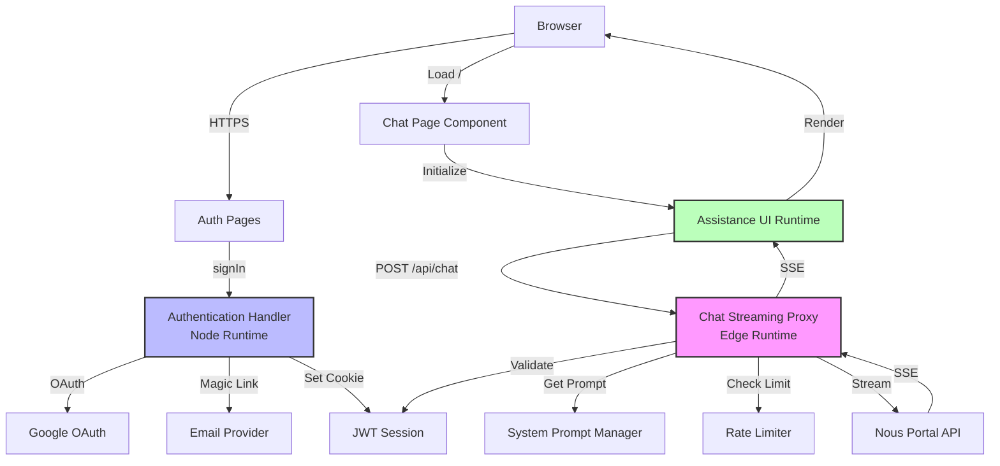

# Components

## System Component Breakdown

BuddahBot architecture consists of 6 major components split across frontend and backend.

---

## Component 1: Authentication Handler

**Responsibility:** Manage user authentication via Google OAuth and Email magic links

**Key Interfaces:**
- `POST /api/auth/signin` - Initiate auth flow
- `GET /api/auth/callback/google` - OAuth callback
- `GET /api/auth/callback/email` - Magic link verification
- `GET /api/auth/session` - Get current session
- `POST /api/auth/signout` - End session

**Dependencies:**
- Auth.js v5 (NextAuth)
- Google OAuth API
- Email provider (Resend/SMTP)

**Technology Stack:**
- Node.js runtime (not Edge - Auth.js requires Node)
- JWT session strategy
- httpOnly secure cookies

**Implementation Notes:**
- Located at `app/api/auth/[...nextauth]/route.ts`
- Centralized config in `lib/auth.ts`
- Session validation via `auth()` helper
- Cookie names: `authjs.session-token` (dev), `__Secure-authjs.session-token` (prod)

---

## Component 2: Chat Streaming Proxy (Edge)

**Responsibility:** Proxy and stream chat requests from client to Nous API with prompt injection

**Key Interfaces:**
- `POST /api/chat` - Chat completion streaming endpoint

**Dependencies:**
- Nous Portal API
- Auth session (for validation)
- System prompts (panel mode)

**Technology Stack:**
- Vercel Edge runtime
- ReadableStream API (Web Streams)
- Zod validation

**Implementation Pattern:**
```typescript
// app/api/chat/route.ts
export const runtime = 'edge';
export const maxDuration = 25; // Vercel limit

export async function POST(req: Request) {
  // 1. Validate session
  const session = await auth();
  if (!session) return unauthorized();

  // 2. Validate + parse input
  const { messages } = ChatRequestSchema.parse(await req.json());

  // 3. Inject system prompt
  const systemPrompt = getSystemPrompt('panel');

  // 4. Forward to Nous API with streaming
  const response = await fetch('https://api.nousresearch.com/v1/chat/completions', {
    method: 'POST',
    headers: {
      'Authorization': `Bearer ${process.env.NOUS_API_KEY}`,
      'Content-Type': 'application/json',
    },
    body: JSON.stringify({
      model: 'Hermes-4-405B',
      messages: [{ role: 'system', content: systemPrompt }, ...messages],
      stream: true,
    }),
  });

  // 5. Pipe stream to client
  return new Response(response.body, {
    headers: {
      'Content-Type': 'text/event-stream',
      'Cache-Control': 'no-cache',
    },
  });
}
```

**Critical Requirements:**
- Must complete within 25 seconds (Edge timeout)
- Stateless (no conversation history storage)
- Error handling mid-stream
- Rate limiting per user

---

## Component 3: Assistance UI Runtime

**Responsibility:** Client-side chat interface and state management

**Key Interfaces:**
- `useDataStreamRuntime({ api: '/api/chat' })` - Initialize runtime
- `useThread()` - Access chat state
- `useThreadRuntime()` - Perform actions

**Dependencies:**
- Next.js client components
- `/api/chat` endpoint
- Auth session (client-side)

**Technology Stack:**
- @assistant-ui/react 0.11.10
- React 19 (canary in Next.js 15)
- Tailwind CSS for styling

**Component Structure:**
```typescript
// app/page.tsx
"use client";

import { useDataStreamRuntime } from "@assistant-ui/react-data-stream";
import { AssistantRuntimeProvider } from "@assistant-ui/react";
import { Thread } from "@/components/chat/Thread";

export default function ChatPage() {
  const runtime = useDataStreamRuntime({
    api: "/api/chat",
  });

  return (
    <AssistantRuntimeProvider runtime={runtime}>
      <main className="h-screen">
        <Thread />
      </main>
    </AssistantRuntimeProvider>
  );
}
```

**State Management:**
- All chat state managed by Assistance UI runtime
- No external state management needed (no Redux/Zustand)
- React Context only for auth session

---

## Component 4: System Prompt Manager

**Responsibility:** Store and retrieve system prompts for different modes

**Key Interfaces:**
- `getSystemPrompt(mode: ModeType): string` - Get prompt text
- `getModeConfig(): ModeConfig` - Get full mode configuration

**Dependencies:** None (pure data)

**Technology Stack:**
- TypeScript constants
- Environment variables (for mode selection)

**Implementation:**
```typescript
// lib/prompts.ts
export const SYSTEM_PROMPTS = {
  panel: `We are in a panel of experts situation where multiple spiritual advisors give answers to the questions people pose.
**Only 3 of them may speak in answer to a question!**

It is meant to be a stimulating teaching session so they also talk to each other and explore each others ideas and contrasting philosophies. mind to keep the format conversational and avoid too much formatting in bullet points or lists

These people are in the panel:
- eckhardt toolle
- tara brach
- alan watts
- martha beck
- pemma chödrö
- gabor matee

# Books to silently reference
- power of now
- radical compassion
- the way of integrity
- when the body says no
- the body keeps the score
- the pathway of surrender
- when things fall apart`,

  // Mode 2/3 deferred to iteration 1
  custom: '',
  wisdom: '',
} as const;

export function getSystemPrompt(mode: ModeType = 'panel'): string {
  return SYSTEM_PROMPTS[mode];
}
```

**Critical Notes:**
- **DO NOT MODIFY** panel prompt text (PRD requirement)
- Use exact text from PRD Section 3
- Mode selection via `process.env.BUDDAHBOT_MODE` (default: "panel")

---

## Component 5: Auth Pages (Login/Error)

**Responsibility:** User-facing authentication UI

**Key Interfaces:**
- `/login` - Sign-in page
- `/auth/error` - Auth error page

**Dependencies:**
- Auth.js `signIn()` helper
- Next.js App Router

**Technology Stack:**
- Server components (page shells)
- Client components (sign-in buttons)
- Tailwind CSS

**Implementation:**
```typescript
// app/login/page.tsx
import { SignInButtons } from "@/components/auth/SignInButtons";

export default function LoginPage() {
  return (
    <main className="flex min-h-screen items-center justify-center">
      <div className="max-w-md w-full space-y-8">
        <h1 className="text-3xl font-bold text-center">BuddahBot</h1>
        <p className="text-center text-gray-600">
          Sign in to access spiritual wisdom guidance
        </p>
        <SignInButtons />
      </div>
    </main>
  );
}

// components/auth/SignInButtons.tsx
"use client";

import { signIn } from "next-auth/react";

export function SignInButtons() {
  return (
    <div className="space-y-4">
      <button
        onClick={() => signIn("google", { callbackUrl: "/" })}
        className="w-full btn-primary"
      >
        Sign in with Google
      </button>
      <button
        onClick={() => signIn("email", { callbackUrl: "/" })}
        className="w-full btn-secondary"
      >
        Sign in with Email
      </button>
    </div>
  );
}
```

---

## Component 6: Rate Limiter (Optional for MVP)

**Responsibility:** Prevent abuse via rate limiting

**Key Interfaces:**
- `checkRateLimit(userId: string): Promise<{ success: boolean }>` - Validate request

**Dependencies:**
- Upstash Redis (or Vercel KV)

**Technology Stack:**
- @upstash/ratelimit
- Edge runtime compatible

**Implementation:**
```typescript
// lib/rate-limit.ts
import { Ratelimit } from "@upstash/ratelimit";
import { Redis } from "@upstash/redis";

export const ratelimit = new Ratelimit({
  redis: Redis.fromEnv(),
  limiter: Ratelimit.slidingWindow(10, "60 s"), // 10 requests per minute
  analytics: true,
});

// Usage in /api/chat
const { success } = await ratelimit.limit(session.user.id);
if (!success) {
  return new Response('Rate limit exceeded', { status: 429 });
}
```

**MVP Decision:** Optional - add if abuse observed

---

## Component Interaction Diagram


