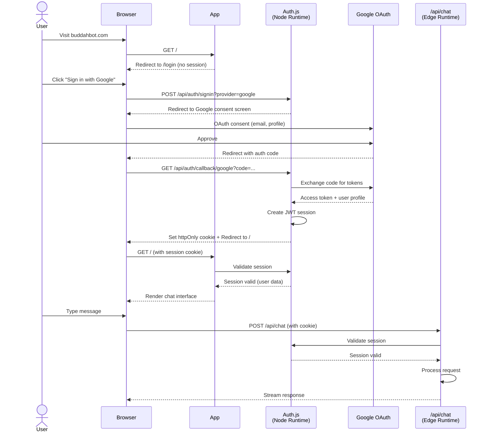
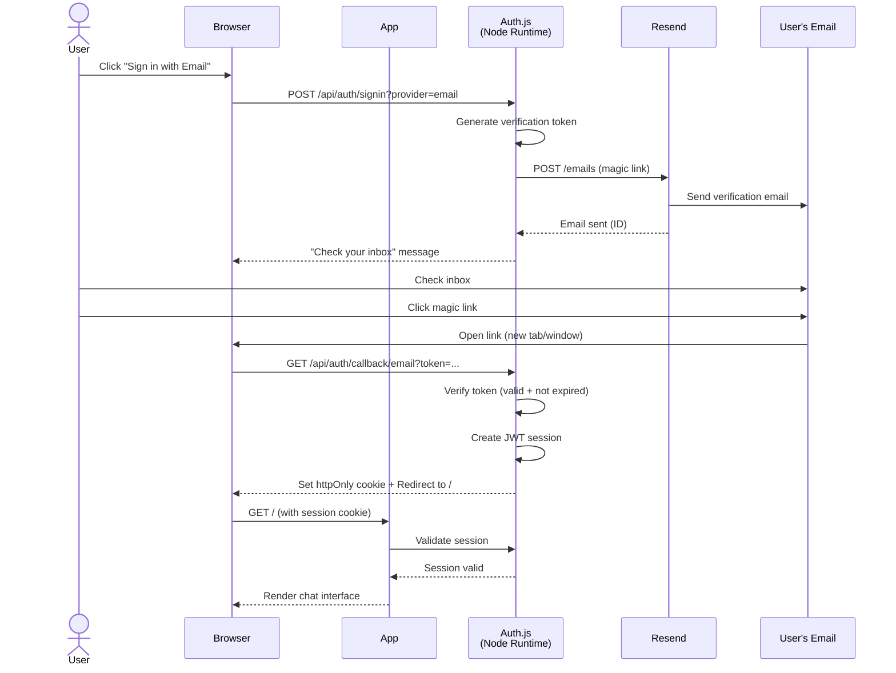
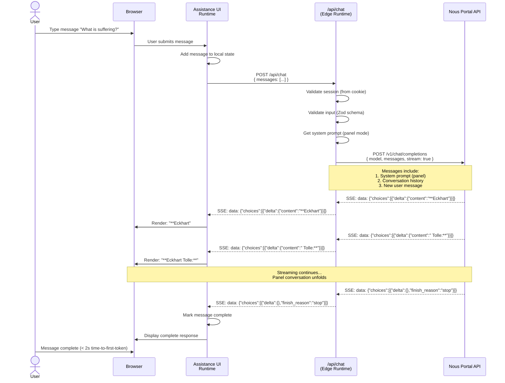
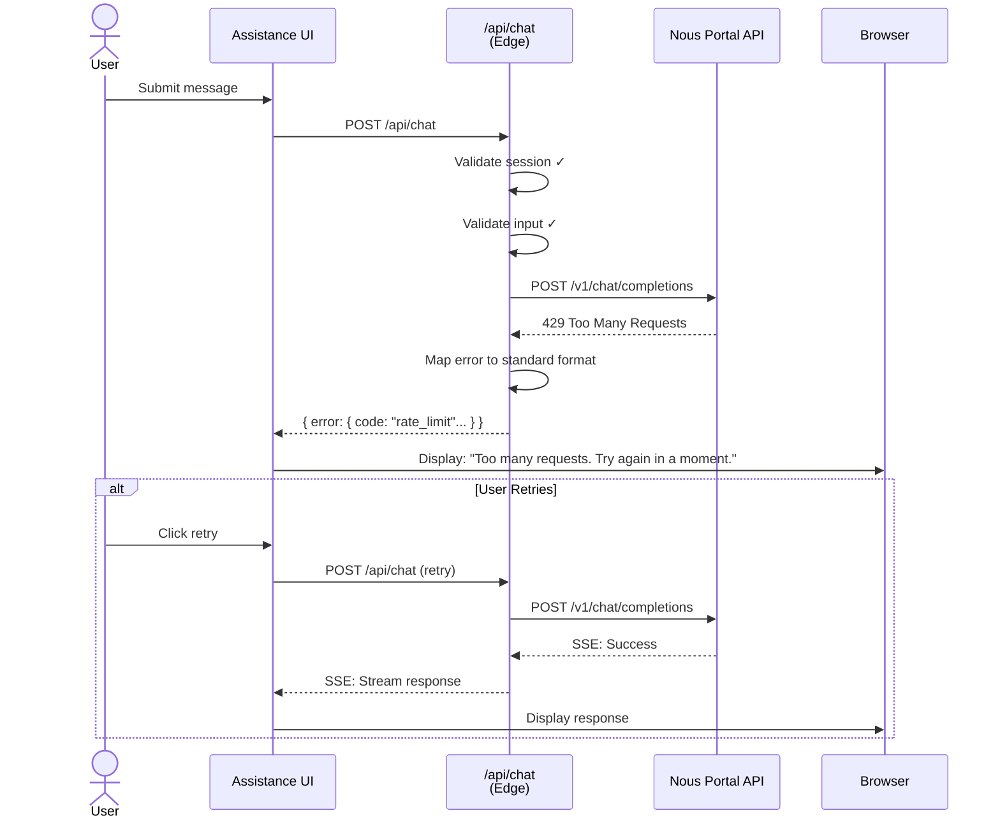
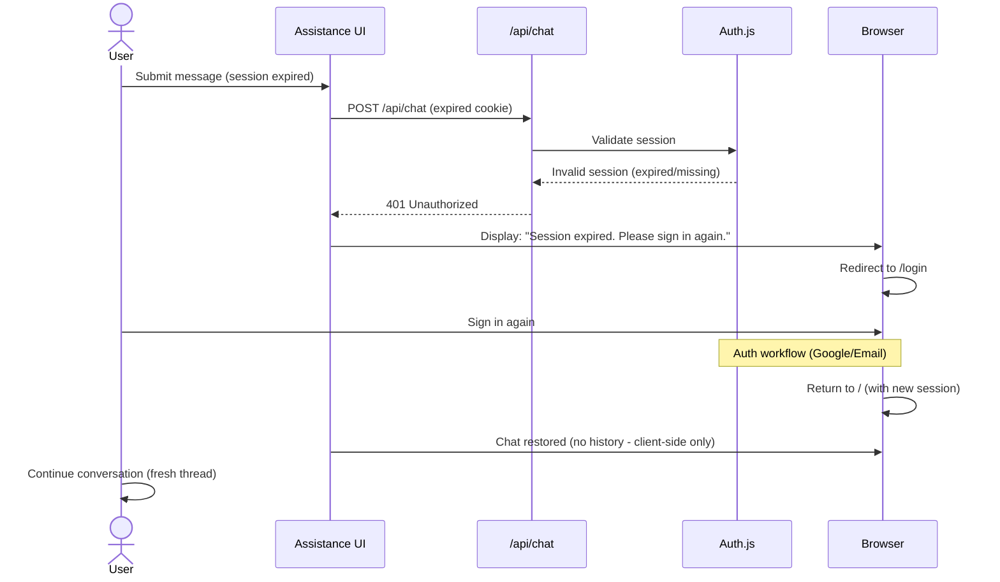

# Core Workflows

## Workflow 1: Google OAuth Authentication

**Key Points:**
- **Stateless:** No server-side session storage (JWT only)
- **Cookie Security:** httpOnly, secure (prod), sameSite=lax
- **Redirect Flow:** `/` → `/login` → Google → callback → `/`
- **Session Lifetime:** 30 days (configurable)

---

## Workflow 2: Email Magic Link Authentication

**Key Points:**
- **Token Expiry:** 24 hours (Auth.js default)
- **One-Time Use:** Token invalidated after use
- **No Password:** Zero password management complexity
- **Email Verification:** User must have access to email inbox

---

## Workflow 3: Chat Streaming (Happy Path)

**Performance Targets:**
- **Time-to-first-token:** < 2 seconds
- **Streaming start:** < 2 seconds (PRD requirement)
- **Total completion:** < 25 seconds (Edge timeout)
- **Request completion rate:** > 99% (PRD requirement)

---

## Workflow 4: Error Handling (Network/API Failure)

**Error Scenarios:**
- **401 Unauthorized:** Session expired → redirect to login
- **422 Validation Error:** Invalid input → display field errors
- **429 Rate Limit:** Too many requests → retry with backoff
- **500 Internal Error:** Nous API down → display generic error + retry option
- **504 Timeout:** Request > 25s → notify user, allow retry

---

## Workflow 5: Session Expiry Mid-Chat

**Session Behavior:**
- **Expiry:** 30 days of inactivity
- **No Persistence:** Previous conversation lost (no DB)
- **Client State:** Assistance UI maintains thread in memory (cleared on refresh)
- **Graceful UX:** Clear message + redirect to login
