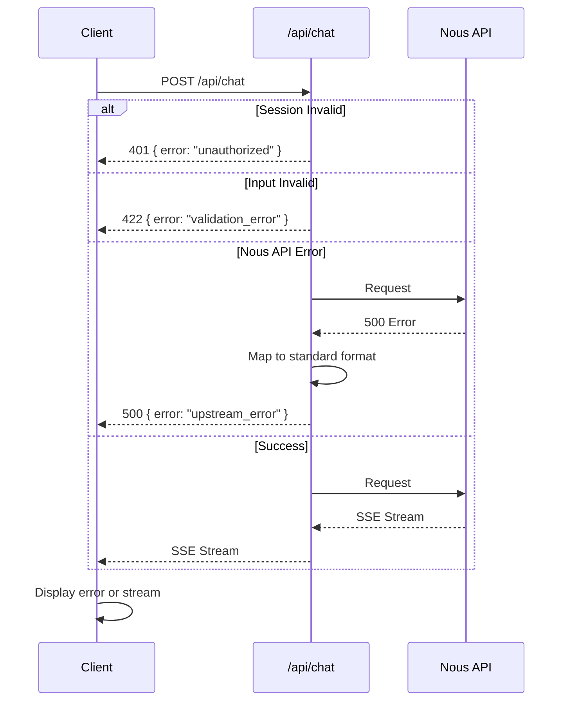

# Error Handling Strategy

## Error Flow



---

## Error Response Format

**All API errors use this standardized format:**

```typescript
interface APIError {
  error: {
    code: string;           // Machine-readable error code
    message: string;        // Human-readable message
    statusCode: number;     // HTTP status code
    details?: any;          // Optional additional context
  };
}
```

**Error Codes:**

| Code | HTTP Status | Meaning | User Action |
|------|------------|---------|-------------|
| `unauthorized` | 401 | Session missing/expired | Redirect to login |
| `validation_error` | 422 | Invalid request format | Show validation errors |
| `rate_limit_exceeded` | 429 | Too many requests | Wait and retry |
| `upstream_error` | 500/502 | Nous API failure | Show retry option |
| `internal_error` | 500 | Unexpected server error | Show generic error |
| `timeout` | 504 | Request exceeded 25s | Allow retry |

---

## Frontend Error Handling

**Assistance UI Error Handling:**

```typescript
// components/chat/Thread.tsx
"use client";

import { useThread } from "@assistant-ui/react";
import { AlertCircle } from "lucide-react";

export function Thread() {
  const { error } = useThread();

  return (
    <ThreadPrimitive.Root>
      {error && (
        <div className="bg-red-50 border border-red-200 rounded-lg p-4 mb-4">
          <div className="flex items-start gap-3">
            <AlertCircle className="w-5 h-5 text-red-600 mt-0.5" />
            <div>
              <h3 className="font-semibold text-red-900">Error</h3>
              <p className="text-red-700 text-sm">
                {error.message || "Something went wrong. Please try again."}
              </p>
              {error.code === 'rate_limit_exceeded' && (
                <p className="text-red-600 text-xs mt-1">
                  You've sent too many messages. Please wait a moment.
                </p>
              )}
            </div>
          </div>
        </div>
      )}

      <ThreadPrimitive.Messages {...} />
      <Composer />
    </ThreadPrimitive.Root>
  );
}
```

**Session Error Handling:**

```typescript
// middleware.ts (already implemented)
// Catches 401 errors and redirects to login

// For client-side session checks:
"use client";

import { useSession } from "next-auth/react";
import { useRouter } from "next/navigation";
import { useEffect } from "react";

export function SessionGuard({ children }) {
  const { status } = useSession();
  const router = useRouter();

  useEffect(() => {
    if (status === "unauthenticated") {
      router.push("/login");
    }
  }, [status, router]);

  if (status === "loading") return <div>Loading...</div>;
  if (status === "unauthenticated") return null;

  return <>{children}</>;
}
```

---

## Backend Error Handling

**Edge Route Error Handler:**

```typescript
// app/api/chat/route.ts (extended version)
import { auth } from "@/lib/auth";
import { z, ZodError } from "zod";

export const runtime = "edge";
export const maxDuration = 25;

// Validation schema
const ChatRequestSchema = z.object({
  messages: z.array(
    z.object({
      role: z.enum(["user", "assistant"]),
      content: z.string().min(1).max(2000),
    })
  ).max(20),
});

// Helper: Standard error response
function errorResponse(
  code: string,
  message: string,
  statusCode: number,
  details?: any
) {
  return new Response(
    JSON.stringify({
      error: { code, message, statusCode, details },
    }),
    {
      status: statusCode,
      headers: { "Content-Type": "application/json" },
    }
  );
}

export async function POST(req: Request) {
  try {
    // 1. Session validation
    const session = await auth();
    if (!session?.user) {
      return errorResponse(
        "unauthorized",
        "Authentication required",
        401
      );
    }

    // 2. Input validation
    const body = await req.json();
    const { messages } = ChatRequestSchema.parse(body);

    // 3. Rate limiting (if enabled)
    // const { success } = await ratelimit.limit(session.user.id);
    // if (!success) {
    //   return errorResponse(
    //     "rate_limit_exceeded",
    //     "Too many requests. Please wait a moment.",
    //     429
    //   );
    // }

    // 4. Get system prompt
    const systemPrompt = getSystemPrompt("panel");

    // 5. Call Nous API
    const nousResponse = await fetch(
      `${process.env.NOUS_API_BASE_URL}/chat/completions`,
      {
        method: "POST",
        headers: {
          "Authorization": `Bearer ${process.env.NOUS_API_KEY}`,
          "Content-Type": "application/json",
        },
        body: JSON.stringify({
          model: process.env.HERMES_MODEL || "Hermes-4-405B",
          messages: [
            { role: "system", content: systemPrompt },
            ...messages,
          ],
          temperature: 0.7,
          max_tokens: 2048,
          stream: true,
        }),
      }
    );

    // 6. Handle Nous API errors
    if (!nousResponse.ok) {
      const errorData = await nousResponse.json().catch(() => ({}));

      // Map common Nous API errors
      if (nousResponse.status === 429) {
        return errorResponse(
          "rate_limit_exceeded",
          "Service rate limit exceeded. Please try again shortly.",
          429
        );
      }

      if (nousResponse.status === 401) {
        console.error("Nous API authentication failed - check NOUS_API_KEY");
        return errorResponse(
          "upstream_error",
          "Service authentication error",
          502
        );
      }

      // Generic upstream error
      return errorResponse(
        "upstream_error",
        errorData.error?.message || "AI service error",
        nousResponse.status
      );
    }

    // 7. Stream response
    return new Response(nousResponse.body, {
      headers: {
        "Content-Type": "text/event-stream; charset=utf-8",
        "Cache-Control": "no-cache, no-transform",
        "Connection": "keep-alive",
      },
    });

  } catch (error) {
    // Validation errors
    if (error instanceof ZodError) {
      return errorResponse(
        "validation_error",
        "Invalid request format",
        422,
        error.errors
      );
    }

    // Unexpected errors
    console.error("Chat route error:", error);
    return errorResponse(
      "internal_error",
      "An unexpected error occurred",
      500
    );
  }
}
```

**Error Logging:**
```typescript
// All errors should be logged with context
console.error("Context:", {
  error: error.message,
  userId: session?.user?.id,
  timestamp: new Date().toISOString(),
  stack: error.stack,
});
```

**Timeout Handling:**
```typescript
// Edge runtime enforces 25s timeout automatically
// No explicit timeout handling needed
// Nous API should respond within Edge timeout

// If implementing custom timeout:
export async function POST(req: Request) {
  const abortController = new AbortController();
  const timeout = setTimeout(() => abortController.abort(), 24000); // 24s

  try {
    const response = await fetch(nousApiUrl, {
      signal: abortController.signal,
      // ... other options
    });

    clearTimeout(timeout);
    return response;
  } catch (error) {
    clearTimeout(timeout);

    if (error.name === 'AbortError') {
      return errorResponse(
        "timeout",
        "Request timed out. Please try again.",
        504
      );
    }

    throw error;
  }
}
```

---

## User-Facing Error Messages

**Map error codes to friendly messages:**

```typescript
// lib/error-messages.ts
export const ERROR_MESSAGES = {
  unauthorized: "Your session has expired. Please sign in again.",
  validation_error: "Please check your message and try again.",
  rate_limit_exceeded: "You're sending messages too quickly. Please wait a moment.",
  upstream_error: "Our AI service is temporarily unavailable. Please try again.",
  internal_error: "Something went wrong. Please try again.",
  timeout: "The request took too long. Please try again.",
};

export function getErrorMessage(code: string): string {
  return ERROR_MESSAGES[code] || ERROR_MESSAGES.internal_error;
}
```

**Usage in components:**
```typescript
import { getErrorMessage } from "@/lib/error-messages";

function ErrorDisplay({ error }) {
  return (
    <div className="error-banner">
      {getErrorMessage(error.code)}
    </div>
  );
}
```
