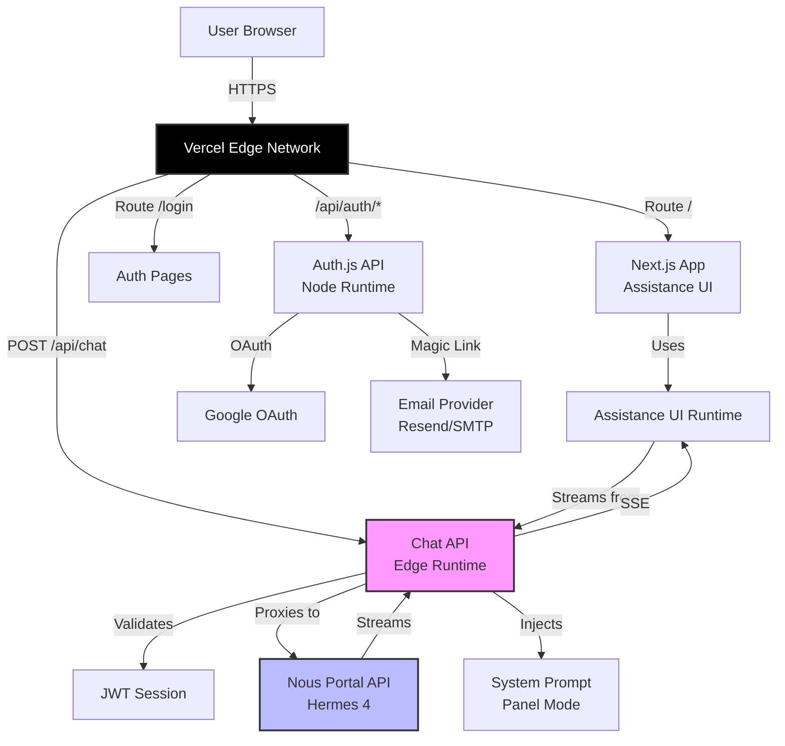

# High Level Architecture

## Technical Summary

BuddhaBot employs a **serverless Jamstack architecture** deployed on Vercel, optimizing for simplicity and zero DevOps overhead. The frontend is built with **Assistance UI framework on Next.js 14 (App Router)** with TypeScript, providing a complete chat interface out-of-the-box. The backend consists of two serverless functions: an **Edge runtime** `/api/chat` route for streaming responses with <2s latency, and a **Node runtime** Auth.js handler for authentication. Authentication uses **Auth.js (NextAuth)** with Google OAuth and email magic links, storing sessions as JWT tokens (no database required). The system proxies requests to the **Nous Portal API** (Hermes 4 405B/70B) with spiritual wisdom prompts injected server-side. This architecture achieves the PRD's goals of <2-click access, <2s streaming start, and 99%+ reliability through Vercel's global edge network and proven serverless patterns.

## Platform and Infrastructure Choice

**Platform: Vercel (Recommended)**

**Key Services:**
- **Edge Functions** - `/api/chat` route (global, low-latency streaming)
- **Serverless Functions** - Auth routes (Node.js runtime)
- **Environment Variables** - Secure secret storage
- **Automatic HTTPS** - SSL/TLS out-of-box
- **CDN** - Static asset delivery
- **Analytics** - Built-in monitoring and logs

**Deployment Host and Regions:** Global edge network (automatic)

**Rationale:**
- Zero DevOps: No server management, auto-scaling, automatic SSL
- Optimal for Next.js: First-party integration, App Router support
- Edge runtime: Low-latency streaming across global regions
- Free tier sufficient for MVP and personal use
- Auth.js works seamlessly with Vercel
- Environment variable management built-in

**Alternative Considered:**
- **AWS (Lambda + API Gateway + CloudFront)**: More complex setup, requires expertise in AWS services, over-engineering for MVP
- **Railway/Render**: Simpler than AWS but no Edge runtime, higher latency for streaming

**Decision:** Vercel - best fit for Next.js + Edge streaming + simplicity goals.

## Repository Structure

**Structure:** Single repository (monolith, not monorepo)

**Monorepo Tool:** N/A - Not needed for this project

**Package Organization:** Standard Next.js App Router structure

**Rationale:**
- MVP has no shared packages or multiple apps
- Frontend and backend are tightly coupled (same Next.js app)
- Auth routes and chat routes live in same `/app/api` folder
- No separate frontend/backend repos needed
- YAGNI principle: Don't add monorepo complexity for single app

**Structure Pattern:**
```
buddha-bot/
├── app/                    # Next.js App Router
│   ├── api/               # API routes
│   │   ├── chat/         # Edge runtime streaming
│   │   └── auth/         # Node runtime auth
│   ├── (pages)/          # Frontend routes
│   └── layout.tsx        # Root layout
├── lib/                   # Shared utilities
├── components/            # React components (minimal)
└── public/               # Static assets
```

**Future Consideration:** If Mode 2/3 or multiple frontends are added, consider migrating to monorepo with Turborepo.

## High Level Architecture Diagram



## Architectural Patterns

- **Jamstack Architecture:** Static frontend with serverless API functions - _Rationale:_ Optimal performance, security, and zero DevOps for personal project with minimal traffic

- **Edge-First Streaming:** Use Edge runtime for streaming responses - _Rationale:_ Global low-latency (<2s time-to-first-token), meets PRD performance requirements

- **Backend for Frontend (BFF) Pattern:** `/api/chat` acts as BFF, proxying and enriching requests to Nous API - _Rationale:_ Keeps API keys secure server-side, allows prompt injection logic, shields client from upstream changes

- **Component-Based UI:** Assistance UI framework provides pre-built React components - _Rationale:_ Avoid reinventing chat UI, focus on spiritual guidance logic, faster MVP delivery

- **Stateless Authentication:** JWT-based sessions without database - _Rationale:_ Simplicity for MVP (no DB to manage), Auth.js handles token security, sufficient for small user base

- **API Gateway Pattern:** Vercel acts as implicit API gateway (routing, SSL, caching) - _Rationale:_ No need for separate gateway service, built into platform

- **Proxy Pattern:** Chat route proxies to external Nous API - _Rationale:_ Secure API key management, centralized error handling, request/response transformation
